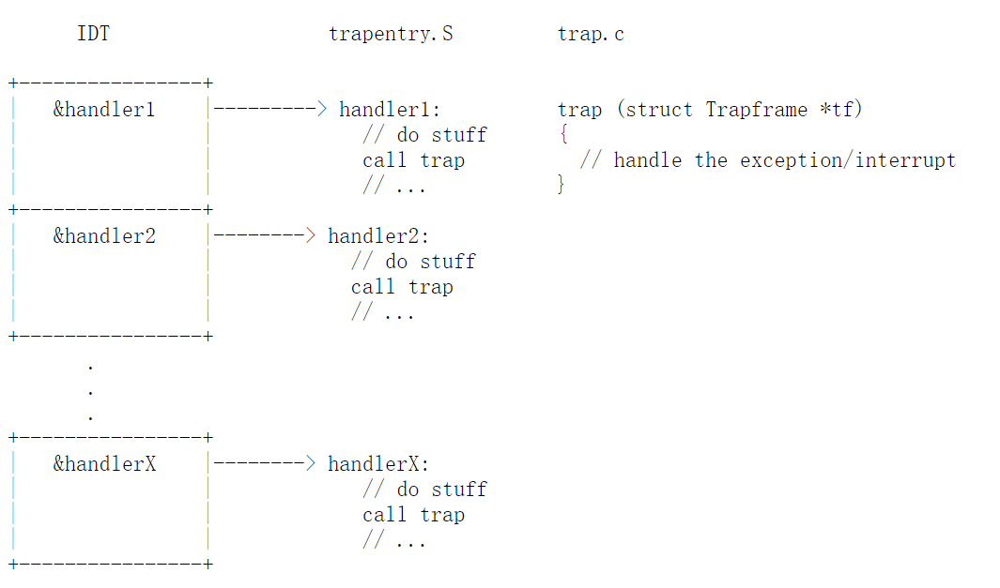
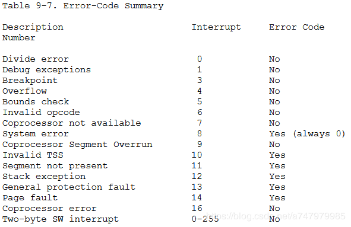
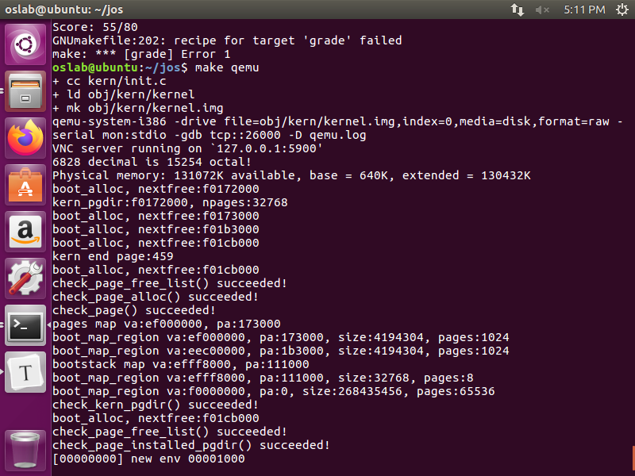
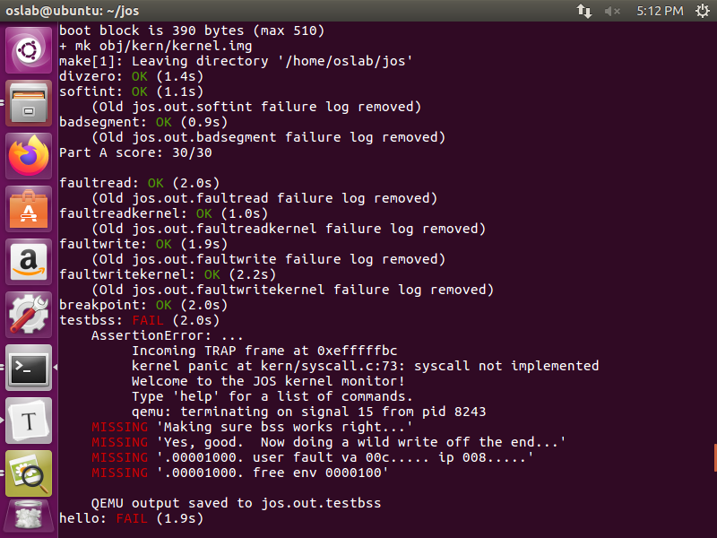
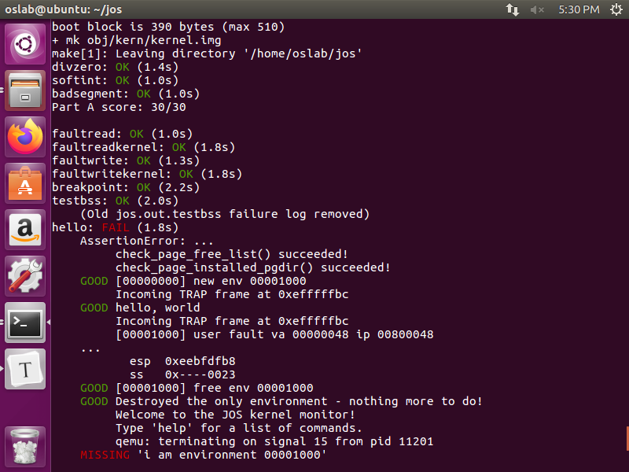
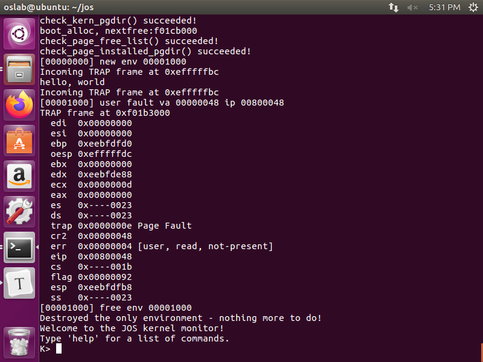
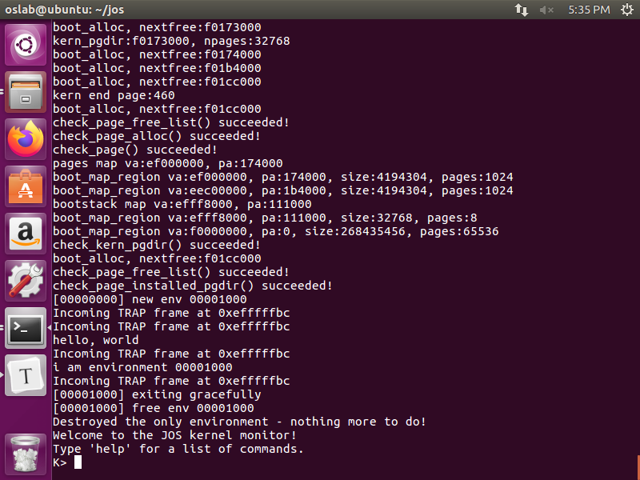
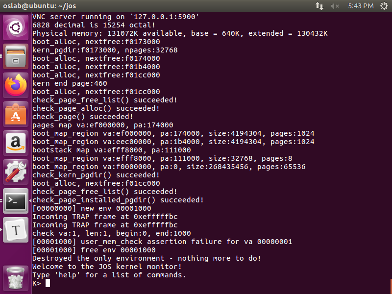
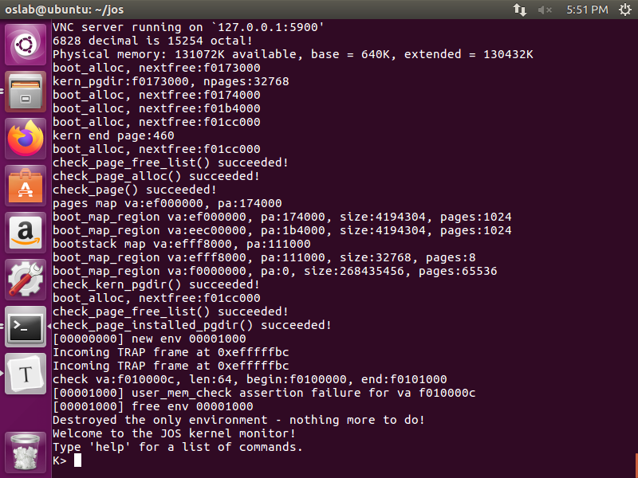
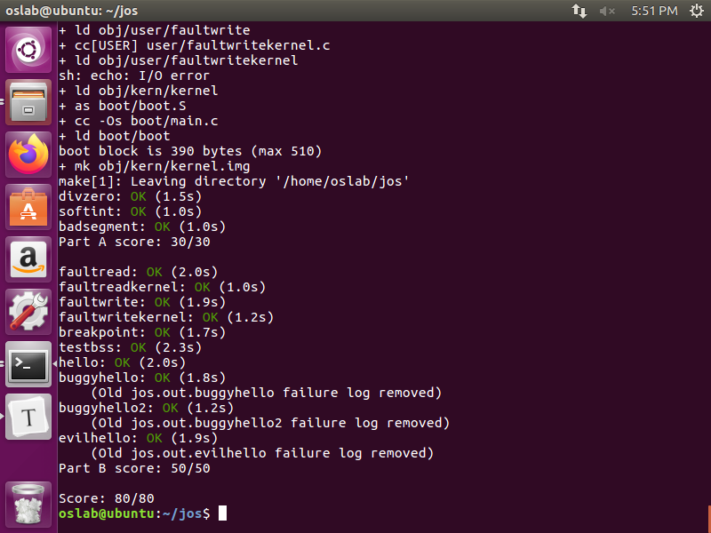

# LAB3

----

lab3中新加入的代码：

| 目录  | 文件        | 说明                                                         |
| ----- | ----------- | ------------------------------------------------------------ |
| inc/  | env.h       | 用户模式进程的公用定义                                       |
|       | trap.h      | 陷阱处理的公用定义                                           |
|       | syscall.h   | 用户进程向内核发起系统调用的公用定义                         |
|       | lib.h       | 用户模式支持库的公用定义                                     |
| kern/ | env.h       | 用户模式进程的内核私有定义                                   |
|       | env.c       | 用户模式进程的内核代码实现                                   |
|       | trap.h      | 陷阱处理的内核私有定义                                       |
|       | trap.c      | 与陷阱处理有关的代码                                         |
|       | trapentry.S | 汇编语言的陷阱处理函数入口点                                 |
|       | syscall.h   | 系统调用处理的内核私有定义                                   |
|       | syscall.c   | 与系统调用实现有关的代码                                     |
| lib/  | Makefrag    | 构建用户模式调用库的 Makefile fragment, obj/lib/libuser.a    |
|       | entry.S     | 汇编语言的用户进程入口点                                     |
|       | libmain.c   | 从 entry.S 进入用户模式的库调用                              |
|       | syscall.c   | 用户模式下的系统调用桩(占位)函数                             |
|       | console.c   | 用户模式下 putchar() 和 getchar() 的实现，提供控制台输入输出 |
|       | exit.c      | 用户模式下 exit() 的实现                                     |
|       | panic.c     | 用户模式下 panic() 的实现                                    |
| user/ | *           | 检查 Lab 3 内核代码的各种测试程序                            |

## PART A

#### Struct Env

在inc/env.h 中定义了用户进程的一个struct ，其包括了一个*struct Trapframe env_tf;*，也就是中断列表，一个指向下一空闲用户进程的列表*Env *env_link*，一个用户进程id号*env_id*,父进程id号*env_parent_id*,用户进程的标记*env_type*，进程的状态*env_status*和进程运行的时间*env_runs*,页目录的虚拟内存地址*env_pgdir*
```c
struct Env { // 用户进程
	struct Trapframe env_tf;	// Saved registers
	struct Env *env_link;		// Next free Env
	envid_t env_id;			// Unique environment identifier
	envid_t env_parent_id;		// env_id of this env's parent
	enum EnvType env_type;		// Indicates special system environments
	unsigned env_status;		// Status of the environment
	uint32_t env_runs;		// Number of times environment has run

	// Address space
	pde_t *env_pgdir;		// Kernel virtual address of page dir
};
```

### exercise one
修改pamp.c文件，其中主要有两个部分需要增加，即分配空间与进行相应的映射。

其实际过程是与之前通过mem_init()中为pages[]分配内存空间的方法类似，首先需要调用*boot_alloc*函数，设定需要分配的内存大小，然后通过*memset*函数初始化整个分配的内存块中的内容，然后为其分配相应的映射，根据代码中相应的提示，**perm = PTE_U | PTE_P**，因此，在调用boot_map_region时，给它赋上相应的permission（权限）

```c
	// Make 'envs' point to an array of size 'NENV' of 'struct Env'.
	// LAB 3: Your code here.
	envs = (struct Env *)boot_alloc(sizeof(struct Env) * NENV);//分配相应的空间
	memset(envs,0,sizeof(struct Env)*NENV);

	// Map the 'envs' array read-only by the user at linear address UENVS
	// (ie. perm = PTE_U | PTE_P).
	// Permissions:
	//    - the new image at UENVS  -- kernel R, user R
	//    - envs itself -- kernel RW, user NONE
	// LAB 3: Your code here.
	boot_map_region(kern_pgdir,UENVS,PTSIZE,PADDR(envs),PTE_U | PTE_P);//并为其分配相应的映射，其权限为PTE_U | PTE_P
```

### exercise two

查看*kern/init.c*中的*i386_init*函数，具体如下所示：

```c
void
i386_init(void)
{
	extern char edata[], end[];

	// Before doing anything else, complete the ELF loading process.
	// Clear the uninitialized global data (BSS) section of our program.
	// This ensures that all static/global variables start out zero.
	memset(edata, 0, end - edata);

	// Initialize the console.
	// Can't call cprintf until after we do this!
	cons_init();

	cprintf("6828 decimal is %o octal!\n", 6828);

	// Lab 2 memory management initialization functions
	mem_init();

	// Lab 3 user environment initialization functions
	env_init();
	trap_init();

#if defined(TEST)
	// Don't touch -- used by grading script!
	ENV_CREATE(TEST, ENV_TYPE_USER);
#else
	// Touch all you want.
	ENV_CREATE(user_hello, ENV_TYPE_USER);
#endif // TEST*

	// We only have one user environment for now, so just run it.
	env_run(&envs[0]);
}
```

可以看到，针对lab3，其调用了*env_init* 和*trap_init* 两个函数，主要是实现本次实验的part A 和 part B 两个部分，其中part A 部分主要是对于用户进程环境的创建。

#### env_init() 

 **`env_init()`** 初始化全部 `envs` 数组中的 `Env` 结构体，并将它们加入到 `env_free_list` 中。还要调用 `env_init_percpu` ，这个函数会通过配置段硬件，将其分隔为特权等级 0 (内核) 和特权等级 3（用户）两个不同的段。 

其中，`env_free_list`也是一个Env 结构体，正如我们之前所看到的那样。 同时可以查看`env_init_percpu`函数，看到此函数实际上是通过内联汇编代码，将不同的内存地址（段）分配给不同的权限。

```c
void
env_init_percpu(void)
{
	lgdt(&gdt_pd);
	// The kernel never uses GS or FS, so we leave those set to
	// the user data segment.
	asm volatile("movw %%ax,%%gs" : : "a" (GD_UD|3));
	asm volatile("movw %%ax,%%fs" : : "a" (GD_UD|3));
	// The kernel does use ES, DS, and SS.  We'll change between
	// the kernel and user data segments as needed.
	asm volatile("movw %%ax,%%es" : : "a" (GD_KD));
	asm volatile("movw %%ax,%%ds" : : "a" (GD_KD));
	asm volatile("movw %%ax,%%ss" : : "a" (GD_KD));
	// Load the kernel text segment into CS.
	asm volatile("ljmp %0,$1f\n 1:\n" : : "i" (GD_KT));
	// For good measure, clear the local descriptor table (LDT),
	// since we don't use it.
	lldt(0);
}
```

在此处完成`env_init`函数：

```c
void
env_init(void)
{
	// Set up envs array
	// LAB 3: Your code here.
    int i = NENV;
    while(i-->0)
    {
        envs[i].env_id = 0;
        envs[i].env_status = ENV_FREE;
        envs[i].env_link = env_free_list;
        env_free_list = &envs[i];
    }
	// Per-CPU part of the initialization
	env_init_percpu();
}
```

可以看到，整个*env_init*函数，主要分成了两个部分，一为初始化整个需要分配的Env结构体，二为调用*env_init_percpu*函数完成划分。其中，第一个部分倒序进行的原因是它相当于一个压栈过程，故而需要把最早使用的放在env_free_list 的最后，也会最早被调用。

#### env_setup_vm()

 **`env_setup_vm()`** 为新的进程分配一个页目录，并初始化新进程的地址空间对应的内核部分。 可以看到，正如注释中所提示的那样，给一个进程分配页目录，即需要构造一个*PageInfo*结构体，并初始化其中的内容，即需要将页目录++，并通过地址转换找到分配的页目录对应的地址，并将其拷贝到内核中，形成一个对应的内核进程，并为其赋予相应的权限。

```c
//
static int
env_setup_vm(struct Env *e)
{
	int i;
	struct PageInfo *p = NULL;

	// Allocate a page for the page directory
	if (!(p = page_alloc(ALLOC_ZERO)))
		return -E_NO_MEM;

	// Now, set e->env_pgdir and initialize the page directory.
	//
	// Hint:
	//    - The VA space of all envs is identical above UTOP
	//	(except at UVPT, which we've set below).
	//	See inc/memlayout.h for permissions and layout.
	//	Can you use kern_pgdir as a template?  Hint: Yes.
	//	(Make sure you got the permissions right in Lab 2.)
	//    - The initial VA below UTOP is empty.
	//    - You do not need to make any more calls to page_alloc.
	//    - Note: In general, pp_ref is not maintained for
	//	physical pages mapped only above UTOP, but env_pgdir
	//	is an exception -- you need to increment env_pgdir's
	//	pp_ref for env_free to work correctly.
	//    - The functions in kern/pmap.h are handy.

	// LAB 3: Your code here.
    p->pp_ref++;
    e->env_pgdir = (pde_t *)page2kva(p);
    memcpy(e->env_pgdir,kern_pgdir,PGSIZE);
	// UVPT maps the env's own page table read-only.
	// Permissions: kernel R, user R
	e->env_pgdir[PDX(UVPT)] = PADDR(e->env_pgdir) | PTE_P | PTE_U;

	return 0;
}
```

#### region_alloc()

 **`region_alloc()`** 为进程分配和映射物理内存。 要为进程分配和映射物理内存，需要通过进程的相应结构和虚拟地址找到其需要映射的空间大小。

```c
static void
region_alloc(struct Env *e, void *va, size_t len)
{
	// LAB 3: Your code here.
	// (But only if you need it for load_icode.)
	//
	// Hint: It is easier to use region_alloc if the caller can pass
	//   'va' and 'len' values that are not page-aligned.
	//   You should round va down, and round (va + len) up.
	//   (Watch out for corner-cases!)
    void *Start = ROUNDDOWN(va,PGSIZE),*End = ROUNDUP(va+len,PGSIZE);
    for(;Start<End;Start+=PGSIZE)
    {
        struct PageInfo *p = page_alloc(0);
        if(!p)
            panic("env region_blloc failed");
        page_insert(e->env_pgdir,p,Start,PTE_W|PTE_U);
    }
}
```

通过虚拟地址*va*和提供的进程大小*len*，利用`ROUNDDOWN`和`ROUNDUP`可以相应需要映射的初始地址和结束地址位置，根据相应的地址，调用`page_alloc`为其分配空间，然后将分配好的物理页插入到进程*e*的*env_pgdir*中，并设置权限为PTE_W | PTE_U。

#### load_icode()

 **`load_icode()`** 你需要处理 ELF 二进制映像，就像是引导加载程序(boot loader)已经做好的那样，并将映像内容读入新进程的用户地址空间。 这里实际上就是需要将得到的像*ELF*这样的二进制映像，在这里是*binary*处理为**ELF**文件，然后根据**ELF**映像进行处理。根据lab1中所提到的**ELF**中的header对于**ELF**文件进行处理。找到相应的ELF开始和结束的位置，在调用`region_alloc`函数映射内存前，需要先设置cr3寄存器内容为进程的页目录物理地址，设置完之后再映射回*kern_pgdir*的物理地址。具体的结构体`ELF`和`Proghdr`定义在`inc/elf.h`之中。其结构为：

```c
struct Elf {
	uint32_t e_magic;	// must equal ELF_MAGIC
	uint8_t e_elf[12];
	uint16_t e_type;
	uint16_t e_machine;
	uint32_t e_version;
	uint32_t e_entry;
	uint32_t e_phoff;
	uint32_t e_shoff;
	uint32_t e_flags;
	uint16_t e_ehsize;
	uint16_t e_phentsize;
	uint16_t e_phnum;
	uint16_t e_shentsize;
	uint16_t e_shnum;
	uint16_t e_shstrndx;
};

struct Proghdr {
	uint32_t p_type;
	uint32_t p_offset;
	uint32_t p_va;
	uint32_t p_pa;
	uint32_t p_filesz;
	uint32_t p_memsz;
	uint32_t p_flags;
	uint32_t p_align;
};
```

最终的结果为：

```c
static void
load_icode(struct Env *e, uint8_t *binary)
{
	// Hints:
	//  Load each program segment into virtual memory
	//  at the address specified in the ELF segment header.
	//  You should only load segments with ph->p_type == ELF_PROG_LOAD.
	//  Each segment's virtual address can be found in ph->p_va
	//  and its size in memory can be found in ph->p_memsz.
	//  The ph->p_filesz bytes from the ELF binary, starting at
	//  'binary + ph->p_offset', should be copied to virtual address
	//  ph->p_va.  Any remaining memory bytes should be cleared to zero.
	//  (The ELF header should have ph->p_filesz <= ph->p_memsz.)
	//  Use functions from the previous lab to allocate and map pages.
	//
	//  All page protection bits should be user read/write for now.
	//  ELF segments are not necessarily page-aligned, but you can
	//  assume for this function that no two segments will touch
	//  the same virtual page.
	//
	//  You may find a function like region_alloc useful.
	//
	//  Loading the segments is much simpler if you can move data
	//  directly into the virtual addresses stored in the ELF binary.
	//  So which page directory should be in force during
	//  this function?
	//
	//  You must also do something with the program's entry point,
	//  to make sure that the environment starts executing there.
	//  What?  (See env_run() and env_pop_tf() below.)

	// LAB 3: Your code here.
    struct Elf * Env_elf = (struct Elf *)binary;
    struct Proghdr *ph,*End_ph;
    ph = (struct Proghdr *)((uint8_t*)(Env_elf) + Env_elf->e_phoff);
    End_ph = ph + Env_elf->e_phnum;
    if(Env_elf->e_magic !=ELF_MAGIC)
    {
        panic("load_icode:not an ELF file");
    }
    
    lcr3(PADDR(e->env_pgdir));
    for(;ph<End_ph;ph++)
    {
        if(ph->p_type == ELF_PROG_LOAD)
        {
            if(ph->p_filesz > ph->p_memsz)
                panic("load_icode: file size if greater than memory size");
            region_alloc(e,(void *)ph->p_va,ph->p_memsz);
            memcpy((void*)ph->p_va,(void *)(binary+ph->p_offset),ph->p_filesz);
            memset((void*)(ph->p_va+ph->p_filesz),0,ph->p_memsz-ph->p_filesz);
        }
    }

    e->env_tf.tf_eip = Env_elf->e_entry;
    lcr3(PADDR(kern_pgdir));
	// Now map one page for the program's initial stack
	// at virtual address USTACKTOP - PGSIZE.
    region_alloc(e,(void*)(USTACKTOP-PGSIZE),PGSIZE);
	// LAB 3: Your code here.
}
```

#### env_create()

 **`env_create()`** 通过调用 `env_alloc` 分配一个新进程，并调用 `load_icode` 读入 ELF 二进制映像。故而，实际上这个函数的实现非常简单，首先根据`env_alloc`分配一个新的进程，其中，$id \ge 0$，否则直接*panic*，并且为其赋上相应的*type*，最后，调用load_icode函数加载binary 中的映像。

```c
void
env_create(uint8_t *binary, enum EnvType type)
{
	// LAB 3: Your code here.
    struct Env * e;
    if(env_alloc(&e,0)<0)
        panic("env_create: less than zero");
    e->env_type = type;
    load_icode(e,binary);
}
```

#### env_run()

 **`env_run()`** 启动给定的在用户模式运行的进程。 根据注释，可以看到整个实际过程需要完成的工作就是进程的切换，将当前正在运行的进程切换到就绪态中，然后将一个新的进程切换进行开始运行，并且更新变量`env_runs`，最后利用*lcr3*函数切换地址空间为运行的当前的页目录的物理地址。而step 2 则需要调用`env_pop_tf`来保存相应的进程信息（退出的进程的相应信息），其具体代码为：

```c
void
env_pop_tf(struct Trapframe *tf)
{
	asm volatile(
		"\tmovl %0,%%esp\n"
		"\tpopal\n"
		"\tpopl %%es\n"
		"\tpopl %%ds\n"
		"\taddl $0x8,%%esp\n" /* skip tf_trapno and tf_errcode */
		"\tiret\n"
		: : "g" (tf) : "memory");
	panic("iret failed");  /* mostly to placate the compiler */
}
```

最终实现的代码为：

```c
void
env_run(struct Env *e)
{
	// Step 1: If this is a context switch (a new environment is running):
	//	   1. Set the current environment (if any) back to
	//	      ENV_RUNNABLE if it is ENV_RUNNING (think about
	//	      what other states it can be in),
	//	   2. Set 'curenv' to the new environment,
	//	   3. Set its status to ENV_RUNNING,
	//	   4. Update its 'env_runs' counter,
	//	   5. Use lcr3() to switch to its address space.
	// Step 2: Use env_pop_tf() to restore the environment's
	//	   registers and drop into user mode in the
	//	   environment.

	// Hint: This function loads the new environment's state from
	//	e->env_tf.  Go back through the code you wrote above
	//	and make sure you have set the relevant parts of
	//	e->env_tf to sensible values.

	// LAB 3: Your code here.

	//panic("env_run not yet implemented");
    if(curenv && curenv->env_status == ENV_RUNNING)
        curenv->env_status = ENV_RUNNABLE;
    curenv = e;
    curenv->env_status = ENV_RUNNING;
    curenv->env_runs ++;
    lcr3(PADDR(curenv->env_pgdir));
    env_pop_tf(&curenv->env_tf);

}
```

此时，调用`make qemu`可以看到相应的结果为：

```shell
6828 decimal is 15254 octal!
Physical memory: 131072K available, base = 640K, extended = 130432K
boot_alloc, nextfree:f017e000
......
EAX=00000000 EBX=00000000 ECX=0000000d EDX=eebfde88
ESI=00000000 EDI=00000000 EBP=eebfde60 ESP=eebfde54
EIP=00800add EFL=00000092 [--S-A--] CPL=3 II=0 A20=1 SMM=0 HLT=0
ES =0023 00000000 ffffffff 00cff300 DPL=3 DS   [-WA]
CS =001b 00000000 ffffffff 00cffa00 DPL=3 CS32 [-R-]
SS =0023 00000000 ffffffff 00cff300 DPL=3 DS   [-WA]
DS =0023 00000000 ffffffff 00cff300 DPL=3 DS   [-WA]
FS =0023 00000000 ffffffff 00cff300 DPL=3 DS   [-WA]
GS =0023 00000000 ffffffff 00cff300 DPL=3 DS   [-WA]
LDT=0000 00000000 00000000 00008200 DPL=0 LDT
TR =0028 f017da20 00000067 00408900 DPL=0 TSS32-avl
GDT=     f011b320 0000002f
IDT=     f017d200 000007ff
CR0=80050033 CR2=00000000 CR3=00044000 CR4=00000000
DR0=00000000 DR1=00000000 DR2=00000000 DR3=00000000 
DR6=ffff0ff0 DR7=00000400
EFER=0000000000000000
Triple fault.  Halting for inspection via QEMU monitor.
```

可以看到，这里有一个错误为：`Triple fault`，如果去看`user\hello.c`的话，可以看到其代码为：

```c
// hello, world
#include <inc/lib.h>

void
umain(int argc, char **argv)
{
	cprintf("hello, world\n");
	cprintf("i am environment %08x\n", thisenv->env_id);
}

```

故实际上，这里调用*cprintf*函数，实际上会从用户态陷入到内核态，而此过程，需要调用 **int $0x30** 指令，但显然我们还没有处理这些东西。用另一种方式来检测现在是否正确： 使用 `make qemu-gdb` 并在 `env_pop_tf` 处设置一个 GDB 断点，这应当是真正进入用户模式前所执行的最后一个内核函数。  用 `si` 指令在这个函数中步进。处理器应该在一个 `iret` 指令后进入用户模式。 接下来，你应该能够看见用户进程的可执行代码的第一个指令：在 `lib/entry.S` 中 `start` 标签的 `cmpl` 指令。 具体执行的结果为：

```shell
(gdb) b env_pop_tf
Breakpoint 1 at 0xf010383e: file kern/env.c, line 462.
(gdb) c
Continuing.
The target architecture is assumed to be i386
=> 0xf010383e <env_pop_tf>:	push   %ebp

Breakpoint 1, env_pop_tf (tf=0xf01bf000) at kern/env.c:462
462	{
(gdb) s
=> 0xf0103844 <env_pop_tf+6>:	mov    0x8(%ebp),%esp
463		asm volatile(
(gdb) s
=> 0x800020:	cmp    $0xeebfe000,%esp
0x00800020 in ?? ()
(gdb) si
=> 0x800026:	jne    0x80002c
0x00800026 in ?? ()
```

### exercise three

 在本次实验中，我们大体上是遵照 Intel 所采用的关于中断、异常或者别的什么的术语。然而，像是 exception, trap,  interrupt, fault 和 abort 这样的词，在不同架构体系或者操作系统中也没有什么标准含义。即使在某个特定的架构，比如  x86，用起它们来也通常不管它们间到底有什么细微的差别。当你在本次实验之外见到它们的时候，它们的含义也许会有些许不同。 

 异常和中断都是"保护控制转移”，这些导致处理器从用户态转移到内核模式 ([CPL](https://en.wikipedia.org/wiki/Protection_ring#Privilege_level) = 0)，用户模式代码在这一过程中没有任何机会来干预内核或者其他进程的行为。在 Intel 的术语中，**中断** 是一个由异步事件造成的保护控制转移，这一事件通常是在处理器外部发生的，例如外接设备的 I/O 活动通知。相反，**异常** 是一个由当前正在运行的代码造成的同步保护控制转移，例如除零或者不合法的内存访问。 

 为了确保这些保护控制转移确实是受 **保护** 的，处理器的中断/异常处理机制被设计成当发生中断或异常时当前运行的代码 *没有机会任意选择从何处陷入内核或如何陷入内核*，而是由处理器确保仅在小心控制的情况下才能进入内核。在 x86 架构中，两种机制协同工作来提供这一保护： 

+  **The Interrupt Descriptor table / 中断描述符表** 处理器确保中断和异常只能导致内核进入一些确定的、设计优良的、 *由内核自身决定的* 入口点，而不是在发生中断或异常时由正在运行的代码决定。 x86 允许最多 256 个不同的进入内核的中断或者异常入口点，每个有不同的 **中断向量**。向量是指从 0 到 255 的数字。一个中断的向量是由中断源决定的：不同的设备，不同的错误情况，或者应用向内核的不同请求会生成带有不同向量的中断。CPU 将向量作为进入处理器 **中断描述符表** 的索引，而这个中断描述符表是由内核在内核私有内存区域建立的，就像 GDT 一样。从这个表中对应的入口，处理器会读取： 
  +  一个读入指令寄存器(EIP)的值，它指向用于处理这一类型异常的内核代码。 
  +  一个读入代码段寄存器(CS)的值，其中包含一些 0-1 位来表示异常处理代码应该运行在哪一个特权等级（在 JOS 中，所有的异常都在内核模式处理，特权等级为0）。 
+  **The Task State Segment / 任务状态段** 处理器需要一处位置，用来在中断或异常发生前保存旧的处理器状态，比如，在处理器调用异常处理函数前的 **EIP** 和 **CS** 的值，使得随后异常处理函数可以恢复旧的状态并从中断的地方继续。但用于保存旧处理器状态的区域必须避免被非特权的用户模式代码访问到，否则有错误的或恶意的用户模式代码可能危及内核安全。 因此，当 x86 处理器遇到使得特权等级从用户模式切换到内核模式的中断或陷阱时，它也会将栈切换到内核的内存中的栈。一个被称作 **任务状态段, TSS** 的结构体来描述这个栈所处的[段选择子](https://en.wikipedia.org/wiki/X86_memory_segmentation)和地址。处理器将 **SS**, **ESP**, **EFLAGS**, **CS**, **EIP** 和一个可能存在的错误代码压入新栈，接着它从中断向量表中读取 **CS** 和 **EIP**，并使 **ESP** 和 **SS** 指向新栈。 即使 TSS 很大，可以服务于多种不同目的，JOS只将它用于定义处理器从用户模式切换到内核模式时的内核栈。因为 JOS 的 “内核模式” 在 x86 中是特权等级 0，当进入内核模式时，处理器用 TSS 结构体的 **ESP0** 和 **SS0** 字段来定义内核栈。JOS 不使用 TSS 中的其他任何字段。 

 x86 处理器可产生的全部同步异常内部使用 0 ~ 31 作为中断向量，因此被映射为中断描述符表入口的 0 ~ 31。例如，一个缺页(page fault, 下同)总会通过向量 14 造成异常。大于 31 的中断向量只被用于 *软件中断*，这些中断可以用 int 指令生成，或者被用于 *异步硬件中断*，当外部设备需要提请注意时由其生成。 

在`inc/trap.h`中，可以看到，如下面所表示的那样：设置了相应的不同的中断向量号。

```c
// Trap numbers
// These are processor defined:
#define T_DIVIDE     0		// divide error
#define T_DEBUG      1		// debug exception
#define T_NMI        2		// non-maskable interrupt
#define T_BRKPT      3		// breakpoint
#define T_OFLOW      4		// overflow
#define T_BOUND      5		// bounds check
#define T_ILLOP      6		// illegal opcode
#define T_DEVICE     7		// device not available
#define T_DBLFLT     8		// double fault
/* #define T_COPROC  9 */	// reserved (not generated by recent processors)
#define T_TSS       10		// invalid task switch segment
#define T_SEGNP     11		// segment not present
#define T_STACK     12		// stack exception
#define T_GPFLT     13		// general protection fault
#define T_PGFLT     14		// page fault
/* #define T_RES    15 */	// reserved
#define T_FPERR     16		// floating point error
#define T_ALIGN     17		// aligment check
#define T_MCHK      18		// machine check
#define T_SIMDERR   19		// SIMD floating point error

// These are arbitrarily chosen, but with care not to overlap
// processor defined exceptions or interrupt vectors.
#define T_SYSCALL   48		// system call
#define T_DEFAULT   500		// catchall

#define IRQ_OFFSET	32	// IRQ 0 corresponds to int IRQ_OFFSET
```

### exercise four

根据下图所提示的那样，去修改 `trapentry.S` 和 `trap.c` 中的代码：



在`trap.c`中，需要初始化中断向量，其中，在`inc/mmu.h`中提供了相应的初始化中断向量的函数，如下面代码所示，因此，在`trap.c`中，只需要声明相应的处理函数`handlerx`将相应的函数变量与中断向量连接起来，进行初始化。

```c
// Set up a normal interrupt/trap gate descriptor.
// - istrap: 1 for a trap (= exception) gate, 0 for an interrupt gate.
    //   see section 9.6.1.3 of the i386 reference: "The difference between
    //   an interrupt gate and a trap gate is in the effect on IF (the
    //   interrupt-enable flag). An interrupt that vectors through an
    //   interrupt gate resets IF, thereby preventing other interrupts from
    //   interfering with the current interrupt handler. A subsequent IRET
    //   instruction restores IF to the value in the EFLAGS image on the
    //   stack. An interrupt through a trap gate does not change IF."
// - sel: Code segment selector for interrupt/trap handler
// - off: Offset in code segment for interrupt/trap handler
// - dpl: Descriptor Privilege Level -
//	  the privilege level required for software to invoke
//	  this interrupt/trap gate explicitly using an int instruction.
#define SETGATE(gate, istrap, sel, off, dpl)			\
{								\
	(gate).gd_off_15_0 = (uint32_t) (off) & 0xffff;		\
	(gate).gd_sel = (sel);					\
	(gate).gd_args = 0;					\
	(gate).gd_rsv1 = 0;					\
	(gate).gd_type = (istrap) ? STS_TG32 : STS_IG32;	\
	(gate).gd_s = 0;					\
	(gate).gd_dpl = (dpl);					\
	(gate).gd_p = 1;					\
	(gate).gd_off_31_16 = (uint32_t) (off) >> 16;		\
}
```

```C
void
trap_init(void)
{
	extern struct Segdesc gdt[];

	// LAB 3: Your code here.
	void handler0();
	void handler1();
	void handler2();
	void handler3();
	void handler4();
	void handler5();
	void handler6();
	void handler7();
	void handler8();
	void handler10();
	void handler11();
	void handler12();
	void handler13();
	void handler14();
	void handler15();
	void handler16();
	void handler48();

	SETGATE(idt[T_DIVIDE], 1, GD_KT, handler0, 0);
	SETGATE(idt[T_DEBUG], 1, GD_KT, handler1, 0);
	SETGATE(idt[T_NMI], 0, GD_KT, handler2, 0);

	// T_BRKPT DPL 3
	SETGATE(idt[T_BRKPT], 1, GD_KT, handler3, 3);

	SETGATE(idt[T_OFLOW], 1, GD_KT, handler4, 0);
	SETGATE(idt[T_BOUND], 1, GD_KT, handler5, 0);
	SETGATE(idt[T_ILLOP], 1, GD_KT, handler6, 0);
	SETGATE(idt[T_DEVICE], 1, GD_KT, handler7, 0);
	SETGATE(idt[T_DBLFLT], 1, GD_KT, handler8, 0);
	SETGATE(idt[T_TSS], 1, GD_KT, handler10, 0);
	SETGATE(idt[T_SEGNP], 1, GD_KT, handler11, 0);
	SETGATE(idt[T_STACK], 1, GD_KT, handler12, 0);
	SETGATE(idt[T_GPFLT], 1, GD_KT, handler13, 0);
	SETGATE(idt[T_PGFLT], 1, GD_KT, handler14, 0);
	SETGATE(idt[T_FPERR], 1, GD_KT, handler16, 0);

	// T_SYSCALL DPL 3
	SETGATE(idt[T_SYSCALL], 0, GD_KT, handler48, 3);

	// Per-CPU setup 
	trap_init_percpu();
}
```

而在`trapentry.S`中初始化中断处理函数，首先可以看到`trapentry.S`的`TRAPHANDLER`和`TRAPHANDLER_NOEC`：

```assembly
 */
#define TRAPHANDLER(name, num)						\
	.globl name;		/* define global symbol for 'name' */	\
	.type name, @function;	/* symbol type is function */		\
	.align 2;		/* align function definition */		\
	name:			/* function starts here */		\
	pushl $(num);							\
	jmp _alltraps

#define TRAPHANDLER_NOEC(name, num)					\
	.globl name;							\
	.type name, @function;						\
	.align 2;							\
	name:								\
	pushl $0;							\
	pushl $(num);							\
	jmp _alltraps
```

可以看到，两者之间的不同只在于`TRAPHANDLER_NOEC`中加上了一个`pushl $0`，实际上这是对于不同的异常和中断处理，是因为对于某些中断时需要压入一个错误码，而另一些不需要。例如对于**T_DIVIDE** 和 **T_PGFLT**这两种不同情况的处理，因为**T_DIVIDE**不需要压入错误码（保存在$0之中），而**T_PGFLT**则需要这样做。

查看**80386**的相应手册，可以看到在[9.10  Error Code Summary](http://oslab.mobisys.cc/pdos.csail.mit.edu/6.828/2014/readings/i386/s09_10.htm)指出了是否需要`Error Code`，对此，得到的结果是：



因此，可以根据此来选择是调用`TRAPHANDLER`还是`TRAPHANDLER_NOEC`。

调用*_alltraps*是为了保存出现异常时的那些参数，即将`ds` 和`es`这两个段保存在其中。根据要求，你的 `_alltraps` 应该：

- 将一些值压栈，使栈帧看起来像是一个 `struct Trapframe`
- 将 `GD_KD` 读入 `%ds` 和 `%es`
- `push %esp` 来传递一个指向这个 `Trapframe` 的指针，作为传给 `trap()` 的参数
- `call trap`

显然，这个调用时不需要返回的，因为对于此的调用过程是直接对于*trap*的处理。

```assembly
/*
 * Lab 3: Your code here for generating entry points for the different traps.
 */

TRAPHANDLER_NOEC(handler0, T_DIVIDE)
TRAPHANDLER_NOEC(handler1, T_DEBUG)
TRAPHANDLER_NOEC(handler2, T_NMI)
TRAPHANDLER_NOEC(handler3, T_BRKPT)
TRAPHANDLER_NOEC(handler4, T_OFLOW)
TRAPHANDLER_NOEC(handler5, T_BOUND)
TRAPHANDLER_NOEC(handler6, T_ILLOP)
TRAPHANDLER(handler7, T_DEVICE)
TRAPHANDLER_NOEC(handler8, T_DBLFLT)
TRAPHANDLER(handler10, T_TSS)
TRAPHANDLER(handler11, T_SEGNP)
TRAPHANDLER(handler12, T_STACK)
TRAPHANDLER(handler13, T_GPFLT)
TRAPHANDLER(handler14, T_PGFLT)
TRAPHANDLER_NOEC(handler16, T_FPERR)
TRAPHANDLER_NOEC(handler48, T_SYSCALL)


/*
 * Lab 3: Your code here for _alltraps
 */
_alltraps:
	pushl %ds
	pushl %es
	pushal
	movw $GD_KD, %ax
	movw %ax, %ds
	movw %ax, %es
	pushl %esp
	call trap /*never return*/

```

做这些处理的作用是在内核栈中构造Trapframe的结构，这样在_alltraps之后，`trap(Trapframe tf)`中参数tf指向的内核栈，而栈中内容正好是一个完整的Trapframe结构。


```
 低地址                                                       高地址
 +---------------------------------------------------------------+             
 |regs | es | ds | trapno | errno | eip | cs | eflags | esp | ss |
 +---------------------------------------------------------------+
```

#### 问题1

 对每一个中断/异常都分别给出中断处理函数的目的是什么？换句话说，如果所有的中断都交给同一个中断处理函数处理，现在我们实现的哪些功能就没办法实现了？ 

答：这是为了区分不同的异常/中断类型，TRAPHANDLER在栈中压入了中断向量trapno和错误码errno，在以方便后面根据异常/中断类型做对应处理。正如我们看到的那样，对于不同的异常和中断，其实质处理过程是不同的，是否要压入`Error Code`，是否要到内核态进行处理等等，需要的内容都是不同的，因此，如果都交给同一个中断处理函数进行处理，这些功能要不就没法实现，要不就只能到内核态再去进行判断，在内核态运行得越久，操作系统出问题的可能性就越大。

#### 问题2

 你有没有额外做什么事情让 `user/softint` 这个程序按预期运行？打分脚本希望它产生一个一般保护错(陷阱 13)，可是 `softint` 的代码却发送的是 `int $14`。*为什么* 这个产生了中断向量 13 ？如果内核允许 `softint` 的 `int $14` 指令去调用内核中断向量 14 所对应的缺页处理函数，会发生什么？ 

答：这是因为我们在SETGATE中对中断向量14设置的DPL为0，从而由于用户程序CPL=3，触发了13异常。如果要允许，可以设置中断向量14的DPL为3，但是我们是不希望用户程序来操作内存的。如果允许`softint`的`int $14`指令调用内核中断向量14所对应的缺页处理函数，那么，用户态就可以操作内存了，这是我们不想看到的一个结果。

至此，除了challenge 之外，**PART A** 就已经完成了，如果*make qemu* 的话，可以看到没有没有报`triple fault`了，但是由于 `user_hello`运行时用了`int 0x30`触发了中断，而我们的trap()函数并没有针对中断做处理，于是会销毁该用户进程并进入 monitor()。而用`make grade`可以看到`divzero, softint, badsegment`这几个测试通过了。具体结果如下图所示：





## PART B

### exercise five

 修改 `trap_dispatch()`，将缺页异常分发给 `page_fault_handler()`。你现在应该能够让 `make grade` 通过 `faultread`，`faultreadkernel`，`faultwrite` 和 `faultwritekernel` 这些测试了。如果这些中的某一个不能正常工作，你应该找找为什么，并且解决它。

首先要解决的是由于中断向量 14, `T_PGFLT`. 对应的缺页异常。由于实际上已经提供了`page_fault_handler()`函数，那么我们只需要判断当前的`Trapframe`中是否有该异常即可，那么代码相应的，就很简单：

```c
	if (tf->tf_trapno == T_PGFLT) {
		return page_fault_handler(tf);
	}
```

对于`page_fault_handler()`函数，其具体为：

```c
void
page_fault_handler(struct Trapframe *tf)
{
	uint32_t fault_va;

	// Read processor's CR2 register to find the faulting address
	fault_va = rcr2();

	// Handle kernel-mode page faults.

	// LAB 3: Your code here.
	if ((tf->tf_cs & 3) == 0) {
		panic("kernel page fault at va:%x\n", fault_va);
	}

	// We've already handled kernel-mode exceptions, so if we get here,
	// the page fault happened in user mode.

	// Destroy the environment that caused the fault.
	cprintf("[%08x] user fault va %08x ip %08x\n",
		curenv->env_id, fault_va, tf->tf_eip);
	print_trapframe(tf);
	env_destroy(curenv);
}
```

### exercise six

 中断向量 3, `T_BKPT`, 所对应的断点异常通常用于调试器。调试器将程序代码中的指令临时替换为一个特别的 1 字节 `int3` 软件中断指令来插入断点，在 JOS 中，我们有一点点滥用这个功能，让它变为任何用户进程都可以唤起 JOS 内核监视器的伪系统调用。 

 修改 `trap_dispatch()` 使断点异常唤起内核监视器。现在，你应该能够让 `make grade` 在 `breakpoint` 测试中成功了。 

由于相当于将`T_BKPT`看作对于唤起一个JOS内核监视器的伪系统调用，那么当遇到该情况时，只需要进行`monitor()`的调用即可。故而只需要添加如下代码：

```c
	if (tf->tf_trapno == T_BRKPT) {
		return monitor(tf);
	}
```


此时，可以看到相应的，`make grade`之后，`faultread`，`faultreadkernel`，`faultwrite` 和 `faultwritekernel`都能够成功通过，然后`breakpoint`也能够通过。


#### 问题3

 断点那个测试样例可能会生成一个断点异常，或者生成一个一般保护错，这取决你是怎样在 IDT 中初始化它的入口的（换句话说，你是怎样在 `trap_init` 中调用 `SETGATE` 方法的）。为什么？你应该做什么才能让断点异常像上面所说的那样工作？怎样的错误配置会导致一般保护错？ 

答：`breakpoint.c`中生成了一个`int $3`的结果，即发生了一个断点处理的异常。这是由于在IDT中，我设置了**SETGATE(idt[T_BRKPT], 1, GD_KT, handler3, 3);**其中**T_BRKPT**的DPL = 3 ，也就是可以直接运行在用户态。如果我错误配置其DPL = 0，那么它将会导致一个一般保护错。

#### 问题4

 你认为这样的机制意义是什么？尤其要想想测试程序 `user/softint` 的所作所为 / 尤其要考虑一下 `user/softint` 测试程序的行为。 

这样的机制在于保护操作系统的安全性，正如之前所提到的那样，我们不能赋予用户态过高的权限，以免产生不必要的意外。


### exercise seven

在内核中断描述符表中为中断向量 `T_SYSCALL` 添加一个处理函数。你需要编辑 `kern/trapentry.S` 和 `kern/trap.c` 的 `trap_init()` 方法。你也需要修改 `trap_dispath()` 来将系统调用中断分发给在 `kern/syscall.c` 中定义的 `syscall()`。确保如果系统调用号不合法，`syscall()` 返回 `-E_INVAL`。你应该读一读并且理解 `lib/syscall.c`（尤其是内联汇编例程）来确定你已经理解了系统调用接口。通过调用相应的内核函数，处理在 `inc/syscall.h` 中定义的所有系统调用。

通过 `make run-hello` 运行你的内核下的 `user/hello` 用户程序，它现在应该能在控制台中打印出 **hello, world** 了，接下来会在用户模式造成一个缺页。如果这些没有发生，也许意味着你的系统调用处理函数不太对。现在应该也能在 `make grade` 中通过 `testbss` 这个测试了。

首先查看 `lib/syscall.c` 中相关的代码：

```c
static inline int32_t
syscall(int num, int check, uint32_t a1, uint32_t a2, uint32_t a3, uint32_t a4, uint32_t a5)
{
	int32_t ret;

	// Generic system call: pass system call number in AX,
	// up to five parameters in DX, CX, BX, DI, SI.
	// Interrupt kernel with T_SYSCALL.
	//
	// The "volatile" tells the assembler not to optimize
	// this instruction away just because we don't use the
	// return value.
	//
	// The last clause tells the assembler that this can
	// potentially change the condition codes and arbitrary
	// memory locations.

	asm volatile("int %1\n"
		     : "=a" (ret)
		     : "i" (T_SYSCALL),
		       "a" (num),
		       "d" (a1),
		       "c" (a2),
		       "b" (a3),
		       "D" (a4),
		       "S" (a5)
		     : "cc", "memory");

	if(check && ret > 0)
		panic("syscall %d returned %d (> 0)", num, ret);

	return ret;
}
```

在之前的过程中，已经添加了相关的系统调用`0x30`在`kern/trapentry.S` 和 `kern/trap.c` 的 `trap_init()` 方法的处理，故，现在还是需要处理两个地方，即`trap_dispath()` 和`kern/syscall.c`。首先查看`kern/syscall.c`中相关的操作，可以实现代码如下：

```c

int32_t
syscall(uint32_t syscallno, uint32_t a1, uint32_t a2, uint32_t a3, uint32_t a4, uint32_t a5)
{
	// Call the function corresponding to the 'syscallno' parameter.
	// Return any appropriate return value.
	// LAB 3: Your code here.

	//panic("syscall not implemented");


	switch (syscallno) {
    case SYS_cputs:
        sys_cputs((char *)a1,a2);
        return 0;
    case SYS_cgetc:
        return sys_cgetc();
    case SYS_getenvid:
        return sys_getenvid();
    case SYS_env_destroy:
        return sys_env_destroy(a1);
	default:
		return -E_INVAL;
	}
}
```

可以知道的是，在`inc/syscall.h`中，定义了相关的不同的`syscallno`:

```c
enum {
	SYS_cputs = 0,
	SYS_cgetc,
	SYS_getenvid,
	SYS_env_destroy,
	NSYSCALLS
};
```

对于`trap_dispatch`中的相应处理，根据`lib/syscall.c`所指示的那样，将不同段的数据传入即可。具体代码如下所示：

```c
	if (tf->tf_trapno == T_SYSCALL) {
		tf->tf_regs.reg_eax = syscall(
			tf->tf_regs.reg_eax,
			tf->tf_regs.reg_edx,
			tf->tf_regs.reg_ecx,
			tf->tf_regs.reg_ebx,
			tf->tf_regs.reg_edi,
			tf->tf_regs.reg_esi
		);
		return;
	}
```

此时进行`make grade`可以看到，`testbss`已经可以通过，但是`hello`还是无法通过，通过执行`make run-hello`可以看到，已经可以打出*hello，world*，但是后续会有一个**page default** 的错误。具体结果如下图所展示：





### exercise eight

 用户程序在 `lib/entry.S` 之上开始运行。在一些初始化后，代码会调用在 `lib/libmain.c` 中的 `libmain()`。你应该修改 `libmain()` 来初始化全局指针 `thisenv` 来指向当前进程在 `envs` 数组对应的 `struct Env` 

 `libmain()` 接下来调用 `umain`，以 hello 这个程序为例，是 `user/hello.c`。注意，它在打出 `hello, world` 后，试图访问 `thisenv->env_id`。这是它之前出错的原因。现在，因为你已经初始化好了 `thisenv`，应该不会再出错了。如果它还是有问题，你也许没有正确的将 `UENVS` 映射为用户可读的（回到在 Part A 的 `pmap.c`，这是我们第一次使用 `UENVS` 这片内存区域的地方。） 

 在用户库文件中补全所需要的代码，并启动你的内核。你应该能看到 `user/hello` 打出了 `hello, world` 和 `i am environment 00001000`。接下来，`user/hello` 尝试通过调用 `sys_env_destory()` 方法退出（在 `lib/libmain.c` 和 `lib/exit.c`）。因为内核目前只支持单用户进程，它应该会报告它已经销毁了这个唯一的进程并进入内核监视器。在这时，你应该能够在 `make grade` 中通过 `hello` 这个测试了。 


首先查看 `inc/env.h` ，可以看到`Struct Env`中的一些相应内容：

```c
// Values of env_status in struct Env
enum {
	ENV_FREE = 0,
	ENV_DYING,
	ENV_RUNNABLE,
	ENV_RUNNING,
	ENV_NOT_RUNNABLE
};

// Special environment types
enum EnvType {
	ENV_TYPE_USER = 0,
};

struct Env {
	struct Trapframe env_tf;	// Saved registers
	struct Env *env_link;		// Next free Env
	envid_t env_id;			// Unique environment identifier
	envid_t env_parent_id;		// env_id of this env's parent
	enum EnvType env_type;		// Indicates special system environments
	unsigned env_status;		// Status of the environment
	uint32_t env_runs;		// Number of times environment has run

	// Address space
	pde_t *env_pgdir;		// Kernel virtual address of page dir
};
```

然后，现在可以去看一下`lib/libmain.c` 中的 `libmain()`。根据提示，很简单的就可以完成它：

```c
#define ENVX(envid)		((envid) & (NENV - 1))

void
libmain(int argc, char **argv)
{
	// set thisenv to point at our Env structure in envs[].
	// LAB 3: Your code here.
	//thisenv = 0;
    thisenv = &envs[ENVX(sys_getenvid())];
	// save the name of the program so that panic() can use it
	if (argc > 0)
		binaryname = argv[0];

	// call user main routine
	umain(argc, argv);

	// exit gracefully
	exit();
}
```

实际上只是调用了`sys_getenvid()`函数，然后将*thisenv*指向它即可。

此时，可以运行指令`make run-hello`并且不再报错，其结果如下：




内存保护是操作系统一个至关重要的功能，用以保证一个程序的错误不会导致其他程序崩溃或者操作系统自身崩溃。

操作系统通常依赖硬件支持来实现内存保护。OS  保持与硬件同步哪些虚拟地址是有效的哪些是无效的。当一个程序试图访问无效的地址或者它无权访问的地址时，处理器可以在出错的指令处停止这个程序，并带着它要进行的操作等信息陷入内核。如果错误可以修正，内核可以修复它并让程序继续运行。如果错误不可修正，程序不能继续运行，因为它永远也不能通过这个造成异常的指令。

系统调用提出了一个与内存保护有关的非常有趣的问题，多数系统调用接口允许用户程序向内核传递指针。这些指针指向提供给内核读取或写入的用户缓冲区。内核在执行系统调用时要对这些指针解引用，这样做存在两个问题：

- 内核发生缺页可能要比在用户程序中缺页有更严重的潜在问题。如果内核在操作自身数据结构的时候发生缺页（内核错误），缺页处理函数应该让内核恐慌（也就是整个系统都会崩溃）。因此当内核对用户提供的指针解引用时，它需要一种办法记住发生的任何缺页事实上都是用户程序造成的。
- 内核通常比用户程序拥有更多的内存权限。用户程序也许会为系统调用传递一个内核可以读写，那个用户程序却无权读写的的内存指针。内核必须小心不要被欺骗并解引用这样的指针，因为这样可能会泄露私有信息或者破坏内核的完整性。

因为这两个原因，内核在处理用户程序提供的指针时必须格外小心。

修改 `kern/trap.c`，如果缺页发生在内核模式，应该恐慌。

提示：要判断缺页是发生在用户模式还是内核模式下，只需检查 `tf_cs` 的低位。

读一读 `kern/pmap.c` 中的 `user_mem_assert` 并实现同一文件下的 `user_mem_check`。

调整 `kern/syscall.c` 来验证系统调用的参数。

启动你的内核，运行 `user/buggyhello` (`make run-buggyhello`)。这个进程应该会被销毁，内核 *不应该* 恐慌，你应该能够看见类似

```shell
[00001000] user_mem_check assertion failure for va 00000001
[00001000] free env 00001000
Destroyed the only environment - nothing more to do!
```

这样的消息。

最后，修改在 `kern/kdebug.c` 的 `debuginfo_eip`，对 `usd`, `stabs`, `stabstr` 都要调用 `user_mem_check`。修改之后，如果你运行 `user/breakpoint` ，你应该能在内核监视器下输入 `backtrace` 并且看到调用堆栈遍历到 `lib/libmain.c`，接下来内核会缺页并恐慌。是什么造成的内核缺页？你不需要解决这个问题，但是你应该知道为什么会发生缺页。（注：如果整个过程都没发生缺页，说明上面的实现可能有问题。如果在能够看到 `lib/libmain.c` 前就发生了缺页，可能说明之前某次实验的代码存在问题，也可能是由于 GCC 的优化，它没有遵守使我们这个功能得以正常工作的函数调用传统，如果你能合理解释它，即使不能看到预期的结果也没有关系。）

首先查看 `kern/pmap.c` 中的 `user_mem_assert` 

```c
void
user_mem_assert(struct Env *env, const void *va, size_t len, int perm)
{
	if (user_mem_check(env, va, len, perm | PTE_U) < 0) {
		cprintf("[%08x] user_mem_check assertion failure for "
			"va %08x\n", env->env_id, user_mem_check_addr);
		env_destroy(env);	// may not return
	}
}
```

可以看到，根据`user_mem_assert`函数的实现，可以看到，实际上如果`user_mem_check`函数过程中，发生小于0的情况，则代表检测失败，有错误发生。

故而，对其实现，应该为：

```c
// Check that an environment is allowed to access the range of memory
// [va, va+len) with permissions 'perm | PTE_P'.
// Normally 'perm' will contain PTE_U at least, but this is not required.
// 'va' and 'len' need not be page-aligned; you must test every page that
// contains any of that range.  You will test either 'len/PGSIZE',
// 'len/PGSIZE + 1', or 'len/PGSIZE + 2' pages.
//
// A user program can access a virtual address if (1) the address is below
// ULIM, and (2) the page table gives it permission.  These are exactly
// the tests you should implement here.
//
// If there is an error, set the 'user_mem_check_addr' variable to the first
// erroneous virtual address.
//
// Returns 0 if the user program can access this range of addresses,
// and -E_FAULT otherwise.
//
int
user_mem_check(struct Env *env, const void *va, size_t len, int perm)
{
	// LAB 3: Your code here.
	uint32_t begin = (uint32_t)ROUNDDOWN(va, PGSIZE), end = (uint32_t)ROUNDUP(va + len, PGSIZE);
	int check_perm = (perm | PTE_P);
	uint32_t check_va = (uint32_t)va;

	cprintf("check va:%x, len:%x, begin:%x, end:%x\n", va, len, begin, end);

	for (; begin < end; begin += PGSIZE) {
		pte_t *pte = pgdir_walk(env->env_pgdir, (void *)begin, 0);
		if ((begin >= ULIM) || !pte || (*pte & check_perm) != check_perm) {
			user_mem_check_addr = (begin >= check_va ? begin : check_va);
			return -E_FAULT;
		}
	}

	return 0;
}

```

首先，类似的，根据虚拟地址找到相应的页的开始和结束，要调用`ROUNDDOWN`和`ROUNDUP`来实现，然后为其进行相应的映射，如果超出了相应的地址（出现在内核地址的位置），那么返回*-E_FAULT*。

然后， 调整 `kern/syscall.c` 来验证系统调用的参数。 

修改为：

```c
static void
sys_cputs(const char *s, size_t len)
{
	// Check that the user has permission to read memory [s, s+len).
	// Destroy the environment if not.

	// LAB 3: Your code here.
    user_mem_assert(curenv,s,len,0);
	// Print the string supplied by the user.
	cprintf("%.*s", len, s);
}
```

主要是在这里进行相应的检测。

此时，按照要求，在`kern/kdebug.c`的`debuginfo_eip()`中加入检查，代码如下：

```c
// Make sure this memory is valid.
// Return -1 if it is not.  Hint: Call user_mem_check.
// LAB 3: Your code here.
if (user_mem_check(curenv, usd, sizeof(struct UserStabData), PTE_U))
    return -1; 
            
// Make sure the STABS and string table memory is valid.
// LAB 3: Your code here.
if (user_mem_check(curenv, stabs, stab_end - stabs, PTE_U))
    return -1;

if (user_mem_check(curenv, stabstr, stabstr_end - stabstr, PTE_U))
    return -1;
```

此时，执行指令：`make run-buggyhello`，可以得到结果如图：



### exercise ten

按照要求，执行相应指令，得到结果：



至此，`make grade`，其结果为：



全部exercise 已完成。


