[TOC]

# LAB4

---

抢占式多任务处理

- 在第一部分，Part A，你将会为 JOS 系统添加多处理器支持，实现轮转调度（round-robin scheduling），并在系统调用中添加一些基础进程管理方法（例如，创建、销毁进程，以及分配和映射内存）；
- 第二部分，Part B，你将会实现类 Unix 的 fork() 方法，以允许用户进程创造自身的拷贝；
- 最终，在 Part C 你将为 JOS 提供进程间通信 (Inter-Process Communication) 支持，允许不同的用户进程显式地彼此交流和同步。你也将会实现硬件时钟中断和抢占。

Lab4 包含一些新的代码文件，你应当在开始之前先浏览它们：

|                 |                                                          |
| --------------- | -------------------------------------------------------- |
| kern/cpu.h      | 内核私有的关于多处理器支持的定义                         |
| kern/mpconfig.c | 用于读取多处理器配置的代码                               |
| kern/lapic.c    | 驱动每个处理器 Local APIC(LAPIC) 单元的内核代码          |
| kern/mpentry.S  | 非启动 CPU 的汇编入口                                    |
| kern/spinlock.h | 内核私有的自旋锁的定义，包括全局内核锁 (big kernel lock) |
| kern/spinlock.c | 实现自旋锁的内核代码                                     |
| kern/sched.c    | 将由你实现的调度方法的代码框架                           |

## PART A

在本次实验的第一部分，你将首先拓展 JOS，使其支持在具有多个处理器的系统上运行，接下来，实现一些新的 JOS 内核系统调用以允许用户进程创建额外的新进程。你还需要实现 *协作式轮转调度* (Cooperative round-robin  scheduling)，允许内核在当前用户进程自愿放弃CPU或退出时切换到另一个进程。在之后的 Part C 你将实现  抢占式调度，以允许内核在一定时间后从一个用户进程中抢占CPU的控制权，即使用户进程不愿合作。

我们将使 JOS 支持 `symmetric multiprocessing` (SMP)，这是一种所有 CPU 均同等地享有系统资源（例如内存和I/O总线）的多处理器模型。虽然所有的 CPU 在 SMP 模型中功能均相同，在启动过程中它们被分为两种类型：`bootstrap processor` (BSP) 和 `application processors` (APs)。前者负责初始化系统和引导操作系统，后者只有在操作系统正常运行后才被前者激活。哪一个处理器会成为 BSP 是由硬件和 BIOS 决定的。直到目前为止，你的所有 JOS 代码均运行在 BSP 上。

在 SMP 系统中，每一个 CPU 均有一个伴随的 `局部APIC(LAPIC)单元`（APIC，Advanced Programmable Interrupt Controller，高级可编程中断控制器）。LAPIC单元 负责在整个系统中分发中断。同时，每个 LAPIC 也为它连接的 CPU 提供一个唯一的身份标识。

在==kern/lapic.c==中，其代码所示如下，其主要包括了一下功能：

- 读取 LAIPC身份标识 (APIC ID) 以分辨我们的代码在哪个 CPU 上运行  (`cpunum()`)
- 从 BSP 向 APs 发送 STARTUP处理器间中断 (Interprocesser Interrupt, IPI) 以激活其他 CPU (`lapic_startap()`)
- 在 Part C，我们为 LAPIC 内置的计时器编程，以触发时钟中断来实现抢占式多任务处理。

```c
physaddr_t lapicaddr;        // Initialized in mpconfig.c
volatile uint32_t *lapic;

int
cpunum(void)
{
	if (lapic)
		return lapic[ID] >> 24;
	return 0;
}//根据lapic 相应的ID来得到最终的CPU
#define IO_RTC  0x70

void
lapic_startap(uint8_t apicid, uint32_t addr)
{
	int i;
	uint16_t *wrv;

	outb(IO_RTC, 0xF);  // offset 0xF is shutdown code
	outb(IO_RTC+1, 0x0A);
	wrv = (uint16_t *)KADDR((0x40 << 4 | 0x67));  // Warm reset vector
	wrv[0] = 0;
	wrv[1] = addr >> 4;

	lapicw(ICRHI, apicid << 24);
	lapicw(ICRLO, INIT | LEVEL | ASSERT);
	microdelay(200);
	lapicw(ICRLO, INIT | LEVEL);
	microdelay(100);    // should be 10ms, but too slow in Bochs!
	for (i = 0; i < 2; i++) {
		lapicw(ICRHI, apicid << 24);
		lapicw(ICRLO, STARTUP | (addr >> 12));
		microdelay(200);
	}
}
```

### exercise 1

处理器通过 映射于内存的输入输出 (memory-mapped I/O, MMIO) 来访问它的 LAPIC。在 MMIO  模式中，物理内存的一部分被硬连线于一些 I/O 设备的寄存器上（译注：I/O 设备的寄存器和内存被映射在物理内存的一些区域），  所以通常用于访问内存的存取指令也可以同样用于访问设备寄存器。

LAPIC 被连接在物理地址 0xFE000000 (距 4GB 还有 32MB 的位置) 的 I/O hole 上，这个地址对我们当前在  KERNBASE 上直接映射来说太高了， 不过 JOS 虚拟内存映射表 在 MMIOBASE 位置留了 4MB  的空隙，所以我们可以将这样的设备映射到这里。

####  要求：

实现在 `kern/pmap.c` 中的 `mmio_map_region` 方法。你可以看看 `kern/lapic.c` 中 `lapic_init` 的开头部分，了解一下它是如何被调用的。你还需要完成接下来的练习，你的 `mmio_map_region` 才能够正常运行。

#### 解答：

首先查看`kern/lapic.c`中的`lapic_init`的开头部分：

```c
void
lapic_init(void)
{
	if (!lapicaddr)
		return;

	cprintf("lapicaddr:%x, ID:%x\n", lapicaddr, ID);

	// lapicaddr is the physical address of the LAPIC's 4K MMIO
	// region.  Map it in to virtual memory so we can access it.
	lapic = mmio_map_region(lapicaddr, 4096);
}
```

可以看到，4096 代表了4MB的空隙，而传递的lapicaddr表示当前的物理地址，故实际上需要将该物理地址映射到相应的虚拟地址即可。故相应的实现应该为：

```c
void *
mmio_map_region(physaddr_t pa, size_t size)
{
	static uintptr_t base = MMIOBASE;

	// Reserve size bytes of virtual memory starting at base and
	// map physical pages [pa,pa+size) to virtual addresses
	// [base,base+size).  Since this is device memory and not
	// regular DRAM, you'll have to tell the CPU that it isn't
	// safe to cache access to this memory.  Luckily, the page
	// tables provide bits for this purpose; simply create the
	// mapping with PTE_PCD|PTE_PWT (cache-disable and
	// write-through) in addition to PTE_W.  (If you're interested
	// in more details on this, see section 10.5 of IA32 volume
	// 3A.)
	//
	// Be sure to round size up to a multiple of PGSIZE and to
	// handle if this reservation would overflow MMIOLIM (it's
	// okay to simply panic if this happens).
	//
	// Hint: The staff solution uses boot_map_region.
	//
	// Your code here:
	//panic("mmio_map_region not implemented");
	size_t begin = ROUNDDOWN(pa, PGSIZE), end = ROUNDUP(pa + size, PGSIZE);
	size_t map_size = end - begin;
	if (base + map_size >= MMIOLIM) {
		panic("Overflow MMIOLIM");
	}
	boot_map_region(kern_pgdir, base, map_size, pa, PTE_PCD|PTE_PWT|PTE_W);
	uintptr_t result = base;
	base += map_size;
	return (void *)result;
}
```

其空间为：

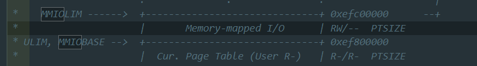

故需要检测其实际空间是否超过了MMIOLIM，然后需要调用之前在lab2中实现的函数，将相应的虚拟地址空间和物理地址建立映射，并且相应的权限，根据代码的提示，应该为：PTE_PCD | PTE_PWT | PTE_W。

### exercise 2

#### 应用处理器(AP)引导程序

在启动 AP 之前，BSP 应当首先收集多处理器系统的信息，例如，CPU总数，他们的 APIC ID，和 LAPIC单元 的 MMIO 地址。在 `kern/mpconfig.c` 中的 `mp_init()` 函数通过读取 BIOS 存储区域的 多处理器配置表(MP configuration table) 来获得相关信息。在`mp_init()`中，调用了相应的mpconfig来查看配置表。

在 `kern/init.c` 的 `boot_aps()` 函数驱动 AP 的引导过程。 AP 从实模式开始启动，就像 在 `boot/boot.S` 中的 **bootloader** 一样。所以 `boot_aps()` 将 AP 的入口代码 ( `kern/mpentry.S` ) 拷贝到一个实模式中能够访问到的内存地址。与 bootloader 不同的是，我们可以控制 AP 从哪里开始执行代码。在这里我们把入口代码拷贝到了 *0x7000* (`MPENTRY_PADDR`)，不过其实 640KB 以下任何一个没有使用的、按页对齐的物理内存均可使用。

而后，`boot_aps()` 通过发送 *STARTUP IPI* （interprocesser interrupt, 处理器间中断） 并提供一个初始 CS:IP （AP 入口代码的位置，我们这里是 `MPENRTY_PADDR` ） 给对应 AP 的 LAPIC 单元 ，依次激活每个 AP。 `kern/mpentry.S` 中的入口代码和 `boot/boot.S` 中的十分相似。在一些简单的处理后，它将 AP 置于保护模式，并启用页表， 接着调用 C 语言的设置例程 `mp_main()` （也在 `kern/init.c` 中）。`boot_aps()` 会等待 AP 在 它的 `struct CpuInfo` 中设置 `cpu_status` 字段为 `CPU_STARTED` 后才开始唤醒下一个 AP。

#### 要求：

阅读 `kern/init.c` 中的 `boot_aps()` 和 `mp_main()` 方法，和 `kern/mpentry.S` 中的汇编代码。确保你已经明白了引导 AP 启动的控制流执行过程。接着，修改你在 `kern/pmap.c` 中实现过的 `page_init()` 以避免将 `MPENTRY_PADDR` 加入到 free list 中，以使得我们可以安全地将 AP 的引导代码拷贝于这个物理地址并运行。你的代码应当通过我们更新过的 `check_page_free_list()` 测试，不过可能仍会在我们更新过的 `check_kern_pgdir()` 测试中失败，我们接下来将解决这个问题。

```c
static void
boot_aps(void)
{
	extern unsigned char mpentry_start[], mpentry_end[];
	void *code;
	struct CpuInfo *c;

	// Write entry code to unused memory at MPENTRY_PADDR
	code = KADDR(MPENTRY_PADDR);
	memmove(code, mpentry_start, mpentry_end - mpentry_start);

	// Boot each AP one at a time
	for (c = cpus; c < cpus + ncpu; c++) {
		if (c == cpus + cpunum())  // We've started already.
			continue;

		// Tell mpentry.S what stack to use 
		mpentry_kstack = percpu_kstacks[c - cpus] + KSTKSIZE;
		// Start the CPU at mpentry_start
		lapic_startap(c->cpu_id, PADDR(code));
		// Wait for the CPU to finish some basic setup in mp_main()
		while(c->cpu_status != CPU_STARTED)
			;
	}
}

void
mp_main(void)
{
	// We are in high EIP now, safe to switch to kern_pgdir 
	lcr3(PADDR(kern_pgdir));
	cprintf("SMP: CPU %d starting\n", cpunum());

	lapic_init();
	env_init_percpu();
	trap_init_percpu();
	xchg(&thiscpu->cpu_status, CPU_STARTED); // tell boot_aps() we're up

	// Now that we have finished some basic setup, call sched_yield()
	// to start running processes on this CPU.  But make sure that
	// only one CPU can enter the scheduler at a time!
	//
	// Your code here:
	// Remove this after you finish Exercise 6
	for (;;);
}
```

可以看到，对于`boot_aps()`函数，其具体为：循环所有的cpu，当某个cpu未启动的时候，将相应的mpentry_kstack进行保存，并调用`lapic_startap`来对其进行相应的处理，一直等到该CPU开启。

对于`mp_main`函数而言，其进行相应的初始化操作，并启动CPU，发送信号给`boot_aps`告诉当前状态。

```assembly
.code16           
.globl mpentry_start
mpentry_start:
	cli            

	xorw    %ax, %ax
	movw    %ax, %ds
	movw    %ax, %es
	movw    %ax, %ss

	lgdt    MPBOOTPHYS(gdtdesc)
	movl    %cr0, %eax
	orl     $CR0_PE, %eax
	movl    %eax, %cr0

	ljmpl   $(PROT_MODE_CSEG), $(MPBOOTPHYS(start32))

.code32
start32:
	movw    $(PROT_MODE_DSEG), %ax
	movw    %ax, %ds
	movw    %ax, %es
	movw    %ax, %ss
	movw    $0, %ax
	movw    %ax, %fs
	movw    %ax, %gs

	# Set up initial page table. We cannot use kern_pgdir yet because
	# we are still running at a low EIP.
	movl    $(RELOC(entry_pgdir)), %eax
	movl    %eax, %cr3
	# Turn on paging.
	movl    %cr0, %eax
	orl     $(CR0_PE|CR0_PG|CR0_WP), %eax
	movl    %eax, %cr0

	# Switch to the per-cpu stack allocated in boot_aps()
	movl    mpentry_kstack, %esp
	movl    $0x0, %ebp       # nuke frame pointer

	# Call mp_main().  (Exercise for the reader: why the indirect call?)
	movl    $mp_main, %eax
	call    *%eax

	# If mp_main returns (it shouldn't), loop.
spin:
	jmp     spin
```

`kern/mpentry.s` 的代码实际上是对于引导的处理，是一个相关的启动代码。其类似于boot.s代码，主要做了一些控制上的处理。

#### 解答：

```c
void
page_init(void)
{
	// LAB 4:
	// Change your code to mark the physical page at MPENTRY_PADDR
	// as in use

	// The example code here marks all physical pages as free.
	// However this is not truly the case.  What memory is free?
	//  1) Mark physical page 0 as in use.
	//     This way we preserve the real-mode IDT and BIOS structures
	//     in case we ever need them.  (Currently we don't, but...)
	//  2) The rest of base memory, [PGSIZE, npages_basemem * PGSIZE)
	//     is free.
	//  3) Then comes the IO hole [IOPHYSMEM, EXTPHYSMEM), which must
	//     never be allocated.
	//  4) Then extended memory [EXTPHYSMEM, ...).
	//     Some of it is in use, some is free. Where is the kernel
	//     in physical memory?  Which pages are already in use for
	//     page tables and other data structures?
	//
	// Change the code to reflect this.
	// NB: DO NOT actually touch the physical memory corresponding to
	// free pages!
	page_free_list = &pages[1];
	struct PageInfo *tail = page_free_list;

	size_t i, mp_page = PGNUM(MPENTRY_PADDR);
	for (i = 1; i < npages_basemem; i++) {
		if (i == mp_page) continue;
		pages[i].pp_ref = 0;
		pages[i].pp_link = NULL;
		tail->pp_link = &pages[i];
		tail = &pages[i];
	}
```

由于相应的要求，故需要排除掉将==MPENTRY_PADDR==加入到其中，即需要判断 `i == mp_page`，如果满足，则不将其加入其中。

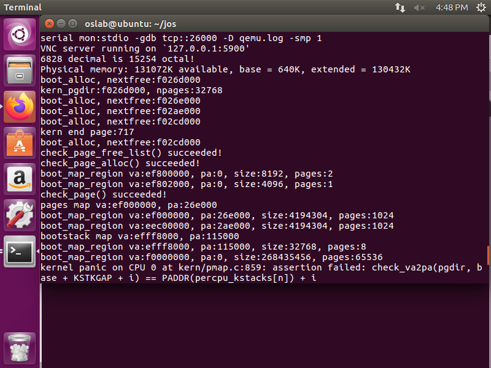

最后的结果如图所示，看到其结果为：`check_page_free_list`能够测试成功，但是在测试`check_kern_pgdir`时出现错误，可以看到，有kernel panic。

#### 问题1：

逐行比较 `kern/mpentry.S` 和 `boot/boot.S`。牢记 `kern/mpentry.S` 和其他内核代码一样也是被编译和链接在 `KERNBASE` 之上运行的。那么，`MPBOOTPHYS` 这个宏定义的目的是什么呢？为什么它在 `kern/mpentry.S` 中是必要的，但在 `boot/boot.S` 却不用？换句话说，如果我们忽略掉 `kern/mpentry.S` 哪里会出现问题呢？ 提示：回忆一下我们在 Lab 1 讨论的链接地址和装载地址的不同之处。

#### 解答：

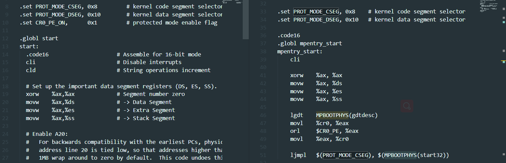

对比代码可以发现`boot/boot.S`与`kern/mpentry.S`中的不同。

这是因为mpentry.S代码mpentry_start, mpentry_end的地址都在KERNBASE(0xf0000000）之上，实模式无法寻址，而我们将mpentry.S加载到了0x7000处，所以需要通过MPBOOTPHYS来寻址。而boot.S加载的位置本身就是实模式可寻址的低地址，所以不用额外转换。

### exercise 3

在编写一个支持多处理器的系统时，将 每个 CPU 各自私有的状态 和 与整个系统共享的公共状态 区别开来是很重要的。`kern/cpu.h` 定义了大多数 CPU 私有的状态，包括 `struct CpuInfo`，它存储着 CPU 私有的变量。`cpunum()` 总是返回调用它的 CPU 的ID, 可以用它来作为数组索引访问诸如 cpus 这样的数组。另外，宏定义 `thiscpu` 是访问当前 CPU 的 `struct CpuInfo` 结构的简写。

下面是你应当知道的每个 CPU 私有的状态：

- 每个CPU的内核堆栈(kernel stack) 因为多个CPU可以同时陷入内核，我们需要为每个 CPU 分别提供内核堆栈以防止它们互相干扰彼此的运行。 `percpu_kstacks[NCPU][KSTKSIZE]` 数组为 NCPU 的内核堆栈预留了空间。 在 Lab 2 中，你把 bootstack 指向的内存映射到了紧邻 `KSTACKTOP` 的下面。相似地，在本次实验中，你会把每个 CPU 的内核堆栈映射到这里，同时，在每个内核堆栈之间会留有一段 守护页 作为它们之间的缓冲区。CPU 0 的堆栈仍然会从 `KSTACKTOP` 向下生长， CPU 1 的堆栈会在 CPU0 栈底的 `KSTKGAP` 以下开始向下生长，以此类推。 `inc/memlayout.h` 展示了内存应当如何映射。
- 每个CPU的任务状态段(task state segment, TSS)和任务段描述符(TSS descriptor) 每个 CPU 也需要各自的 TSS 以指定 CPU 的内核堆栈在何处。 CPU i 的 TSS 存储在 `cpus[i].cpu_ts` 中，相应的 TSS descriptor 在 GDT 入口 `gdt[(GD_TSS0 >> 3) + i]` 中被定义。在 `kern/trap.c` 中定义的全局变量 ts 此时将不再有用。
- 每个CPU的当前进程指针 因为每一个 CPU 可以同时运行不同的用户进程，我们重新定义了宏 `curenv` 来指代 `cpus[cpunum()].cpu_env` (或者 `thiscpu->cpuenv`)，指向 当前 运行在当前 CPU 的进程。
- 每个CPU的系统寄存器 所有寄存器，包括系统寄存器，都是CPU私有的，因此，初始化这些寄存器的指令，例如，`lcr3()`，`ltr()`，`lgdt()`，`lidt()` 等，都应当在每个 CPU 中执行一次。 函数 `env_init_percpu()` 和 `trap_init_percpu()` 就是为了这一目的而定义的。

#### 要求：

修改位于 kern/pmap.c 中的 `mem_init_mp()`，将每个CPU堆栈映射在 `KSTACKTOP` 开始的区域，就像 `inc/memlayout.h` 中描述的那样。每个堆栈的大小都是 `KSTKSIZE` 字节，加上 `KSTKGAP` 字节没有被映射的 守护页 。现在，你的代码应当能够通过我们新的 `check_kern_pgdir()` 测试了。

#### 解答：

按照相应的映射，如`inc/memlayout.h`所示的那样：

```c
/*
 * Virtual memory map:                                Permissions
 *                                                    kernel/user
 *
 *    4 Gig -------->  +------------------------------+
 *                     |                              | RW/--
 *                     ~~~~~~~~~~~~~~~~~~~~~~~~~~~~~~~~
 *                     :              .               :
 *                     :              .               :
 *                     :              .               :
 *                     |~~~~~~~~~~~~~~~~~~~~~~~~~~~~~~| RW/--
 *                     |                              | RW/--
 *                     |   Remapped Physical Memory   | RW/--
 *                     |                              | RW/--
 *    KERNBASE, ---->  +------------------------------+ 0xf0000000      --+
 *    KSTACKTOP        |     CPU0's Kernel Stack      | RW/--  KSTKSIZE   |
 *                     | - - - - - - - - - - - - - - -|                   |
 *                     |      Invalid Memory (*)      | --/--  KSTKGAP    |
 *                     +------------------------------+                   |
 *                     |     CPU1's Kernel Stack      | RW/--  KSTKSIZE   |
 *                     | - - - - - - - - - - - - - - -|                 PTSIZE
 *                     |      Invalid Memory (*)      | --/--  KSTKGAP    |
 *                     +------------------------------+                   |
 *                     :              .               :                   |
 *                     :              .               :                   |
 *    MMIOLIM ------>  +------------------------------+ 0xefc00000      --+
 *                     |       Memory-mapped I/O      | RW/--  PTSIZE
 * ULIM, MMIOBASE -->  +------------------------------+ 0xef800000
 *                     |  Cur. Page Table (User R-)   | R-/R-  PTSIZE
 *    UVPT      ---->  +------------------------------+ 0xef400000
 *                     |          RO PAGES            | R-/R-  PTSIZE
 *    UPAGES    ---->  +------------------------------+ 0xef000000
 *                     |           RO ENVS            | R-/R-  PTSIZE
 * UTOP,UENVS ------>  +------------------------------+ 0xeec00000
 * UXSTACKTOP -/       |     User Exception Stack     | RW/RW  PGSIZE
 *                     +------------------------------+ 0xeebff000
 *                     |       Empty Memory (*)       | --/--  PGSIZE
 *    USTACKTOP  --->  +------------------------------+ 0xeebfe000
 *                     |      Normal User Stack       | RW/RW  PGSIZE
 *                     +------------------------------+ 0xeebfd000
 *                     |                              |
 *                     |                              |
 *                     ~~~~~~~~~~~~~~~~~~~~~~~~~~~~~~~~
 *                     .                              .
 *                     .                              .
 *                     .                              .
 *                     |~~~~~~~~~~~~~~~~~~~~~~~~~~~~~~|
 *                     |     Program Data & Heap      |
 *    UTEXT -------->  +------------------------------+ 0x00800000
 *    PFTEMP ------->  |       Empty Memory (*)       |        PTSIZE
 *                     |                              |
 *    UTEMP -------->  +------------------------------+ 0x00400000      --+
 *                     |       Empty Memory (*)       |                   |
 *                     | - - - - - - - - - - - - - - -|                   |
 *                     |  User STAB Data (optional)   |                 PTSIZE
 *    USTABDATA ---->  +------------------------------+ 0x00200000        |
 *                     |       Empty Memory (*)       |                   |
 *    0 ------------>  +------------------------------+                 --+
 *
 * (*) Note: The kernel ensures that "Invalid Memory" is *never* mapped.
 *     "Empty Memory" is normally unmapped, but user programs may map pages
 *     there if desired.  JOS user programs map pages temporarily at UTEMP.
 */
```

根据相应的要求，所需要实现的代码也非常简单，只需要将相应的堆栈映射到相应的地址空间即可。

```c
static void
mem_init_mp(void)
{
	// Map per-CPU stacks starting at KSTACKTOP, for up to 'NCPU' CPUs.
	//
	// For CPU i, use the physical memory that 'percpu_kstacks[i]' refers
	// to as its kernel stack. CPU i's kernel stack grows down from virtual
	// address kstacktop_i = KSTACKTOP - i * (KSTKSIZE + KSTKGAP), and is
	// divided into two pieces, just like the single stack you set up in
	// mem_init:
	//     * [kstacktop_i - KSTKSIZE, kstacktop_i)
	//          -- backed by physical memory
	//     * [kstacktop_i - (KSTKSIZE + KSTKGAP), kstacktop_i - KSTKSIZE)
	//          -- not backed; so if the kernel overflows its stack,
	//             it will fault rather than overwrite another CPU's stack.
	//             Known as a "guard page".
	//     Permissions: kernel RW, user NONE
	//
	// LAB 4: Your code here:
	int i;
	for (i = 0; i < NCPU; i++) {
		int kstacktop_i = KSTACKTOP - KSTKSIZE - i * (KSTKSIZE + KSTKGAP);
		boot_map_region(kern_pgdir, kstacktop_i, KSTKSIZE, PADDR(percpu_kstacks[i]), PTE_W);
	}

}
```

只需要将相应的CPU根据序号分配到相应的地址空间 ==KSTACKTOP - KSTKSIZE - i *(KSTKSIZE + KSTKGAP)== 即可。同时，需要赋予的权限为：PTE_W，在注释中亦有说明。

这时候运行`make grade`，可以看到`check_kern_pgdir()`已经可以成功运行。

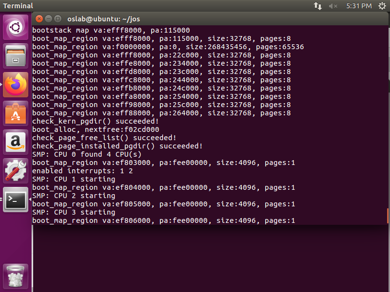


### exercise 4

#### 要求：

位于 `kern/trap.c` 中的 `trap_init_percpu()` 为 BSP 初始化了 TSS 和 TSS描述符，它在 Lab 3 中可以工作，但是在其他 CPU 上运行时，它是不正确的。修改这段代码使得它能够在所有 CPU 上正确执行。（注意：你的代码不应该再使用全局变量 ts。）

#### 解答：

```c
void
trap_init_percpu(void)
{
	// The example code here sets up the Task State Segment (TSS) and
	// the TSS descriptor for CPU 0. But it is incorrect if we are
	// running on other CPUs because each CPU has its own kernel stack.
	// Fix the code so that it works for all CPUs.
	//
	// Hints:
	//   - The macro "thiscpu" always refers to the current CPU's
	//     struct CpuInfo;
	//   - The ID of the current CPU is given by cpunum() or
	//     thiscpu->cpu_id;
	//   - Use "thiscpu->cpu_ts" as the TSS for the current CPU,
	//     rather than the global "ts" variable;
	//   - Use gdt[(GD_TSS0 >> 3) + i] for CPU i's TSS descriptor;
	//   - You mapped the per-CPU kernel stacks in mem_init_mp()
	//   - Initialize cpu_ts.ts_iomb to prevent unauthorized environments
	//     from doing IO (0 is not the correct value!)
	//
	// ltr sets a 'busy' flag in the TSS selector, so if you
	// accidentally load the same TSS on more than one CPU, you'll
	// get a triple fault.  If you set up an individual CPU's TSS
	// wrong, you may not get a fault until you try to return from
	// user space on that CPU.
	//
	// LAB 4: Your code here:
	int cpu_id = thiscpu->cpu_id;
	struct Taskstate *this_ts = &thiscpu->cpu_ts;

	// Setup a TSS so that we get the right stack
	// when we trap to the kernel.
	this_ts->ts_esp0 = KSTACKTOP - cpu_id * (KSTKSIZE + KSTKGAP);
	this_ts->ts_ss0 = GD_KD;
	this_ts->ts_iomb = sizeof(struct Taskstate);

	// Initialize the TSS slot of the gdt.
	gdt[(GD_TSS0 >> 3) + cpu_id] = SEG16(STS_T32A, (uint32_t) (this_ts),
					sizeof(struct Taskstate) - 1, 0);
	gdt[(GD_TSS0 >> 3) + cpu_id].sd_s = 0;

	// Load the TSS selector (like other segment selectors, the
	// bottom three bits are special; we leave them 0)
	ltr(GD_TSS0 + (cpu_id << 3));

	// Load the IDT
	lidt(&idt_pd);
}
```

具体代码实现如上所示：为了使得其能够在所有的CPU上运行，即需要使用thiscpu来指示当前的cpuid,tss等属性，根据注释要求完成代码即可。

完成之后，运行`make qemu CPUS=4`，其最终结果为：

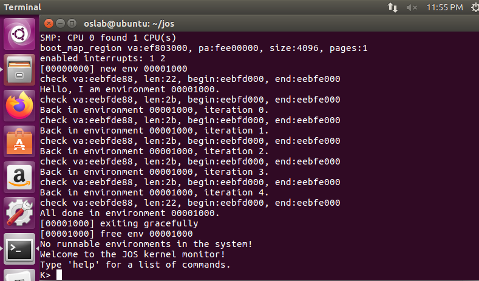

### exercise 5

#### 加锁

目前我们的代码在 `mp_main()` 初始化完 AP 就不再继续执行了。在允许 AP 继续运行之前，我们需要首先提到当多个 CPU 同时运行内核代码时造成的 *竞争状态* (race condition) ，为了解决它，最简单的办法是使用一个 *全局内核锁* (big kernel lock)。这个 big kernel lock  是唯一的一个全局锁，每当有进程进入内核模式的时候，应当首先获得它，当进程回到用户模式的时候，释放它。在这一模式中，用户模式的进程可以并发地运行在 任何可用的 CPU 中，但是最多只有一个进程可以运行在内核模式下。其他试图进入内核模式的进程必须等待。

`kern/spinlock.h` 的 `kernel lock` 声明了这个全局内核锁，并提供了 `lock_kernel()` 和 `unlock_kernel()` 两个方法来方便获得和释放锁。你应当在以下 4 个位置使用全局内核锁：

- `i386_init()` 中，在 BSP 唤醒其他 CPU 之前获得内核锁
- `mp_main()` 中，在初始化完 AP 后获得内核锁，接着调用 `sched_yield()` 来开始在这个 AP 上运行进程。
- `trap()` 中，从用户模式陷入(trap into)内核模式之前获得锁。你可以通过检查 `tf_cs` 的低位判断这一 trap 发生在用户模式还是内核模式（译注：Lab 3 中曾经使用过这一检查）
- env_run() 中，恰好在 **回到用户进程之前** 释放内核锁。不要太早或太晚做这件事，否则可能会出现竞争或死锁。

#### 要求：

在上述提到的位置使用内核锁，加锁时使用 `lock_kernel()`， 释放锁时使用 `unlock_kernel()`。

#### 解答：

```c
// 加锁位置1 i386_init()的 boot_aps()函数前。
@@ -50,6 +50,7 @@ i386_init(void)
 
        // Acquire the big kernel lock before waking up APs
        // Your code here:
+       lock_kernel();
 
        // Starting non-boot CPUs
        boot_aps();

// 加锁位置2 mp_main()的函数末尾，这里还要加上 sched_yield()。
@@ -116,9 +120,11 @@ mp_main(void)
        // only one CPU can enter the scheduler at a time!
        //
        // Your code here:
+       lock_kernel();
 

// 加锁位置3 trap()里面

+++ b/kern/trap.c
@@ -286,6 +286,7 @@ trap(struct Trapframe *tf)
                // Acquire the big kernel lock before doing any
                // serious kernel work.
                // LAB 4: Your code here.
+               lock_kernel();
                assert(curenv);
                
// 释放锁
@@ -535,6 +535,7 @@ env_run(struct Env *e)
        curenv->env_status = ENV_RUNNING;
        curenv->env_runs++;
        lcr3(PADDR(curenv->env_pgdir));
+       unlock_kernel();
        env_pop_tf(&curenv->env_tf);
 }
```

根据前述的要求，需要加锁和解锁的位置已经相应，对于`i386_init()`中，显然需要在`boot_aps()`之前加锁，这样才能在运行AP之前加上锁。而对于`mp_main()`中而言，显然需要其在继续执行之前加上锁，即当其传递了相应信号，但是还未执行之前加上锁。而对于`trap()`而言，在检测当前的运行环境的时候(进程)，就需要加上锁。最终，在`env_run()`中解锁，即在回到用户进程之前释放内核锁，即调用`lcr3`的时候。

#### 问题2：

看起来使用全局内核锁能够保证同一时段内只有一个 CPU 能够运行内核代码。既然这样，我们为什么还需要为每个 CPU 分配不同的内核堆栈呢？请描述一个即使我们使用了全局内核锁，共享内核堆栈仍会导致错误的情形。

#### 解答：

这是因为虽然全局内核锁限制了多个进程同时执行内核代码，但是在陷入trap()之前，CPU硬件已经自动压栈了SS, ESP, EFLAGS, CS, EIP等寄存器内容，而且在`trapentry.S`中也压入了错误码和中断号到内核栈中，所以不同CPU必须分开内核栈，否则多个CPU同时陷入内核时会破坏栈结构，此时都还没有进入到trap()的加大内核锁位置。

### exercise 6

#### 轮转调度算法

你的下一个任务是修改 JOS 内核以使其能够以 轮转 的方式在多个进程中切换。JOS 的轮转调度算法像这样工作：

- `kern/sched.c` 中的 `sched_yied()` 函数负责挑选一个进程运行。它从刚刚在运行的进程开始，按顺序循环搜索 `envs[]` 数组（如果从来没有运行过进程，那么就从数组起点开始搜索），选择它遇到的第一个处于 `ENV_RUNNABLE`（参考 `inc/env.h`）状态的进程，并调用 `env_run()` 来运行它。
- `sched_yield()` 绝不应当在两个CPU上同时运行同一进程。它可以分辨出一个进程正在其他CPU（或者就在当前CPU）上运行，因为这样的进程处于 `ENV_RUNNING` 状态。
- 我们已经为你实现了新的系统调用 `sys_yield()`，用户进程可以调用它来触发内核的 `sched_yield()` 方法，自愿放弃 CPU，给其他进程运行。

#### 要求；

按照以上描述，实现 `sched_yield()` 轮转算法。不要忘记修改你的 `syscall()` 将相应的系统调用分发至 `sys_yield()`（译注：以后还要添加新的系统调用，同样不要忘记修改 `sys_yield()`）。

确保你在 `mp_main` 中调用了 `sched_yield()`。

修改你的 `kern/init.c` 创建三个或更多进程，运行 `user/yield.c`。 运行 `make qemu`。 你应当看到进程在退出之前会在彼此之间来回切换 5 次，就像下面这样：

```shell
...
Hello, I am environment 00001000.
Hello, I am environment 00001001.
Hello, I am environment 00001002.
Back in environment 00001000, iteration 0.
Back in environment 00001001, iteration 0.
Back in environment 00001002, iteration 0.
Back in environment 00001000, iteration 1.
Back in environment 00001001, iteration 1.
Back in environment 00001002, iteration 1.
...
```

在 `yield` 测试程序退出后，系统中没有其他运行的进程了，调度器应当调用 JOS 的 内核监视器(kernel monitor)。如果这些没有发生，你应当在继续之前检查你的代码。

你也应当用 `make qemu CPUS=2` 测试一下。

如果你此时使用 `CPUS=1`，所有的用户进程应当成功运行并退出。使用超过 1 个 CPU 在没有更多的用户进程可以运行时，可能会导致发生 General Protection 或者 Kernel Page Fault，因为我们没有处理时钟中断。我们将会在下面修复这个问题。

#### 解答：

```c
void
sched_yield(void)
{
	struct Env *idle;

	// Implement simple round-robin scheduling.
	//
	// Search through 'envs' for an ENV_RUNNABLE environment in
	// circular fashion starting just after the env this CPU was
	// last running.  Switch to the first such environment found.
	//
	// If no envs are runnable, but the environment previously
	// running on this CPU is still ENV_RUNNING, it's okay to
	// choose that environment.
	//
	// Never choose an environment that's currently running on
	// another CPU (env_status == ENV_RUNNING). If there are
	// no runnable environments, simply drop through to the code
	// below to halt the cpu.

	// LAB 4: Your code here.
	idle = curenv;
	int start_envid = idle ? ENVX(idle->env_id)+1 : 0;

	for (int i = 0; i < NENV; i++) {
		int j = (start_envid + i) % NENV;
		if (envs[j].env_status == ENV_RUNNABLE) {
			env_run(&envs[j]);
		}
	}

	if (idle && idle->env_status == ENV_RUNNING) {
		env_run(idle);
	}

	// sched_halt never returns
	sched_halt();
}
```

同时需要修改`mp_main`中的代码：

```c
@@ -116,9 +120,11 @@ mp_main(void)
        // only one CPU can enter the scheduler at a time!
        //
        // Your code here:
+       lock_kernel();
+       sched_yield();
 
        // Remove this after you finish Exercise 6
-       for (;;);
+       // for (;;);
```

代码的实现非常简单，只需要查看当前是否有进程在运行，并从其开始，进行相应的搜索，查看是否可以找到`ENV_RUNNABLE`的进程即可。如果没有，当前进程如果还需要运行则继续运行，否则`halt`。

在`kern/init.c`中创建三个或更多进程，运行`user/yield.c`

```c
// kern/syscall.c修改
@@ -284,6 +284,9 @@ syscall(uint32_t syscallno, uint32_t a1, uint32_t a2, uint32_t a3, uint32_t a4,
                return sys_getenvid();
        case SYS_env_destroy:
                return sys_env_destroy(a1);
+       case SYS_yield:
+               sys_yield();
+               return 0;
        default:
                return -E_INVAL;
        }
   
// 修改测试进程     
@@ -59,7 +60,10 @@ i386_init(void)
        ENV_CREATE(TEST, ENV_TYPE_USER);
 #else
        // Touch all you want.
-       ENV_CREATE(user_primes, ENV_TYPE_USER);
+       // ENV_CREATE(user_primes, ENV_TYPE_USER);
+       ENV_CREATE(user_yield, ENV_TYPE_USER);
+       ENV_CREATE(user_yield, ENV_TYPE_USER);
+       ENV_CREATE(user_yield, ENV_TYPE_USER);
```

运行的结果为：

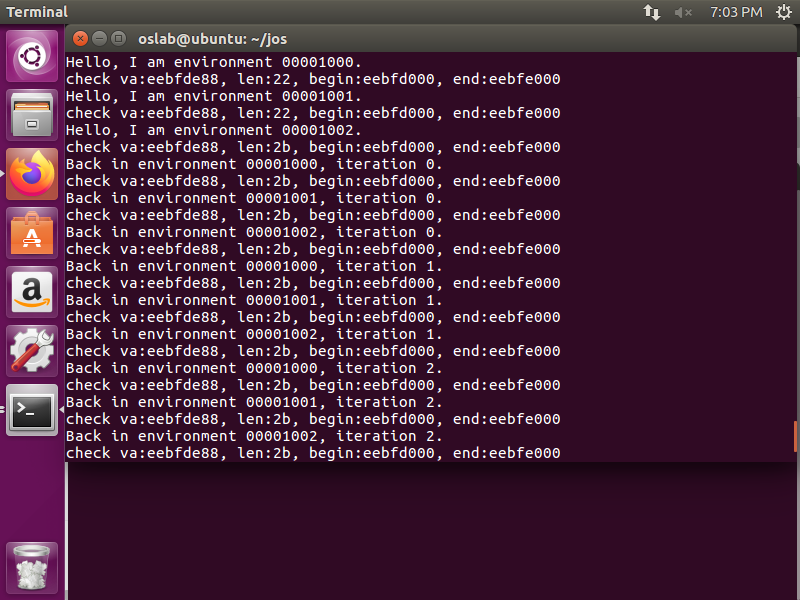

可以看到，能够正常运行，并且运行`make qemu CPUS=2`则会出现下面的错误：

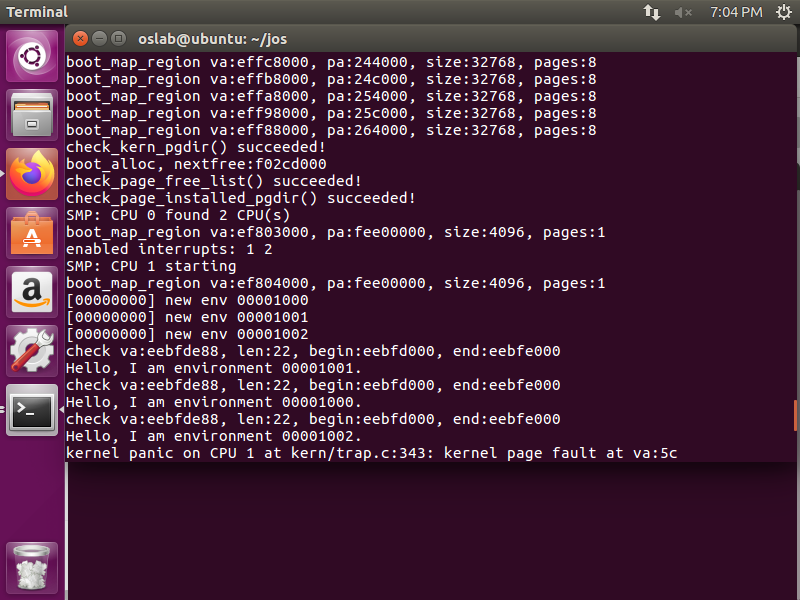

#### 问题3

在你实现的 `env_run()` 中你应当调用了 `lcr3()`。在调用 `lcr3()` 之前和之后，你的代码应当都在引用 变量 `e`，就是 `env_run()` 所需要的参数。 在装载 `%cr3` 寄存器之后， MMU 使用的地址上下文立刻发生改变，但是处在之前地址上下文的虚拟地址（比如说 `e` ）却还能够正常工作，为什么 `e` 在地址切换前后都可以被正确地解引用呢？

#### 解答：

`lcr3()`函数通过lcr3指令把页目录的起始地址存入CR3寄存器。这是因为所有的进程env_pgdir的高地址的映射跟kern_pgdir的是一样的，见实验3的`env_setup_vm()`。

```c
static int
env_setup_vm(struct Env *e)
{
	int i;
	struct PageInfo *p = NULL;

	// Allocate a page for the page directory
	if (!(p = page_alloc(ALLOC_ZERO)))
		return -E_NO_MEM;
	p->pp_ref++;
	e->env_pgdir = (pde_t *)page2kva(p);
	memcpy(e->env_pgdir, kern_pgdir, PGSIZE);

	e->env_pgdir[PDX(UVPT)] = PADDR(e->env_pgdir) | PTE_P | PTE_U;

	return 0;
}
```

#### 问题4

无论何时，内核在从一个进程切换到另一个进程时，它应当确保旧的寄存器被保存，以使得以后能够恢复。为什么？在哪里实现的呢？

#### 解答：

保存寄存器状态，是为了知道下一条指令地址以及进程栈的状态，不然我们不知道从哪里继续运行。保存寄存器状态的代码是 trap.c 中的 `curenv->env_tf = *tf`;

### exercise 7

#### 用于创建进程的系统调用

你将提供一系列不同的、更原始的系统调用来创建新的用户进程。通过这些系统调用，你将能够完全在用户空间实现类似 Unix 的 `fork()` 作为其他创建进程方式的补充。你将会为 JOS 实现的新的系统调用包括：

- `sys_exofork`:

  该系统调用创建一个几乎完全空白的新进程：它的用户地址空间没有内存映射，也不可以运行。这个新的进程拥有和创建它的父进程（调用这一方法的进程）一样的寄存器状态。在父进程中，`sys_exofork` 会返回刚刚创建的新进程的 `envid_t`（或者一个负的错误代码，如果进程分配失败）。在子进程中，它应当返回0。（因为子进程开始时被标记为不可运行，`sys_exofork` 并不会真的返回到子进程，除非父进程显式地将其标记为可以运行以允许子进程运行。

- `sys_env_set_status`:

  将一个进程的状态设置为 `ENV_RUNNABLE` 或 `ENV_NOT_RUNNABLE`。这个系统调用通常用来在新创建的进程的地址空间和寄存器状态已经初始化完毕后将它标记为就绪状态。

- `sys_page_alloc`:

  分配一个物理内存页面，并将它映射在给定进程虚拟地址空间的给定虚拟地址上。

- `sys_page_map`:

  从一个进程的地址空间拷贝一个页的映射 (**不是** 页的内容) 到另一个进程的地址空间，新进程和旧进程的映射应当指向同一个物理内存区域，使两个进程得以共享内存。

- `sys_page_unmap`:

  取消给定进程在给定虚拟地址的页映射。

对于所有以上提到的接受 Environment ID 作为参数的系统调用，JOS 内核支持用 0 指代当前进程的惯例。这一惯例在 `kern/env.c` 的 `envid2env()` 函数中被实现。

我们在测试程序 `user/dumbfork.c` 中提供了一种非常原始的 Unix 样式的 `fork()`。它使用上述系统调用来创建并运行一个子进程，子进程的地址空间就是父进程的拷贝。接着，这两个进程将会通过上一个练习中实现的系统调用 `sys_yield` 来回切换。 父进程在切换 10 次后退出，子进程切换 20 次。

#### 要求：

在 `kern/syscall.c` 中实现上面描述的系统调用。你将需要用到在 `kern/pmap.c` 和 `kern/env.c` 中定义的多个函数，尤其是 `envid2env()`。此时，无论何时你调用 `envid2env()`，都应该传递 1 给 `checkperm` 参数。确定你检查了每个系统调用参数均合法，否则返回 `-E_INVAL`。 用 `user/dumbfork` 来测试你的 JOS 内核，在继续前确定它正常的工作。（`make run-dumbfork`）

#### 解答：

```c
int32_t
syscall(uint32_t syscallno, uint32_t a1, uint32_t a2, uint32_t a3, uint32_t a4, uint32_t a5)
{
	// Call the function corresponding to the 'syscallno' parameter.
	// Return any appropriate return value.
	// LAB 3: Your code here.

	//panic("syscall not implemented");

	switch (syscallno) {
	case SYS_cputs:
		sys_cputs((char *)a1, a2);
		return 0;
	case SYS_cgetc:
		return sys_cgetc();
	case SYS_getenvid:
		return sys_getenvid();
	case SYS_env_destroy:
		return sys_env_destroy(a1);
	case SYS_yield:
		sys_yield();
		return 0;
	case SYS_exofork:
		return sys_exofork();
	case SYS_env_set_status:
		return sys_env_set_status(a1, a2);
	case SYS_page_alloc:
		return sys_page_alloc(a1, (void *)a2, a3);
	case SYS_page_map:
		return sys_page_map(a1, (void*)a2, a3, (void*)a4, a5);
	case SYS_page_unmap:
		return sys_page_unmap(a1, (void *)a2);
	case SYS_env_set_pgfault_upcall:
		return sys_env_set_pgfault_upcall(a1, (void *)a2);
	case SYS_ipc_try_send:
		return sys_ipc_try_send(a1, a2, (void *)a3, a4);
	case SYS_ipc_recv:
		return sys_ipc_recv((void *)a1);
	default:
		return -E_INVAL;
	}
}
```

根据上述要求，实现相应的调用，参数的调用可以根据提示确定。`make run-dumbfork`则可以直接确定为：

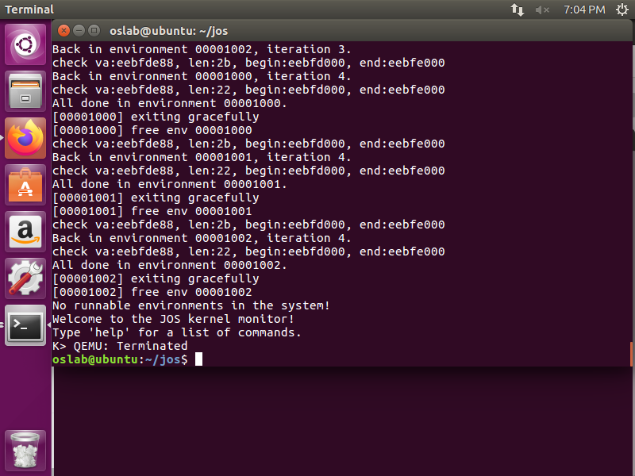

然后，进行`make grade`测试，可以看到结果为：

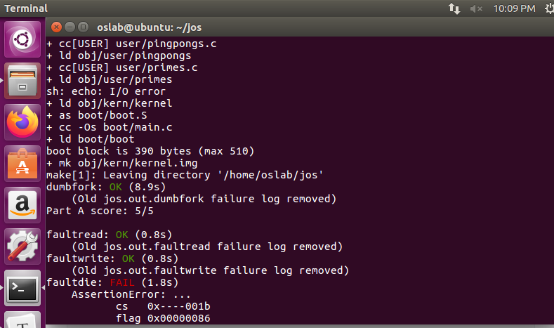

其最终结果为5分，part A部分已经完成。

## PART B

在本次实验接下来的部分，你将会实现 *真正的* ，采取写时复制方式的类 Unix 的 `fork()` 作为用户空间的调用库例程(user space library routine)。在用户空间实现 `fork()` 和写时复制支持的好处是，内核仍旧很简单，因此更容易保持正确。它也使得每个用户进程能够定义它们自己的 `fork()` 策略(semantic)。如果一个进程想要使用一些不同的实现方式（比如，我们在 `dumpfork()` 中引入的 总是拷贝 版本， 或者使 `fork()` 之后父进程和子进程完全共享空间），它们可轻易地自行实现。

### 用户模式下的缺页处理

用户模式写时复制版本的 `fork()` 需要知道那些由在写保护的页面上进行写操作引起的缺页，所以这是你将在这部分首先实现的内容。写时复制只是众多可能的用户缺页处理应用中的一种。

It’s common to set up an address space so that page faults indicate  when some action needs to take place. /  通常在我们建立好地址空间后，发生缺页都意味着需要执行一些操作。比如，大多数 Unix 内核一开始只在新的进程的 *堆栈*  区域映射一个页面，之后，随着进程栈的增长，在尚未映射的内核地址造成缺页时，为其分配并映射更多的栈页面。一个通常的 Unix  内核必须追踪进程在不同内存区域缺页时应当进行什么操作，例如，当缺页发生在栈区域时通常需要分配并映射新的物理页，当发生在程序的 BSS  （Block Started by Symbol，用于存储全局静态变量，应当由操作系统初始化为 0）区域时通常需要分配一个新的物理页、用 0  填充并映射它。在 demand-paging （译注：在需要时才在硬盘中读取相应的代码）的系统中，在 text（代码段）  区域发生的缺页会从硬盘中读取相应的页面并映射它。

对于内核来说，需要追踪的信息太多了。此处我们不使用传统的 Unix 处理方式，你将在用户空间决定应当如何处理缺页，这样可以使 Bug  的破坏性变得小一些。这种处理方式也使得应用程序在定义其内存区域时拥有更大的灵活性。在随后的实验中你将需要用到用户模式的缺页处理机制，映射并访问以磁盘为基础的文件系统上的文件。

### exercise 8

#### 设置缺页处理函数

为了处理自己的缺页，用户进程需要向 JOS 内核注册一个 *page fault handler entry point* 缺页处理函数入口点。 用户进程通过我们新引入的 `sys_env_set_pgfault_upcall` 系统调用注册它的缺页处理入口。我们也在 Env 结构体中添加了一个新的成员，`env_pgfault_upcall`，来记录这一信息

#### 要求：

实现 `sys_env_set_pgfault_upcall` 系统调用。因为这是一个 “危险” 的系统调用，不要忘记在获得目标进程信息时启用权限检查。

#### 解答：

完成sys_env_set_pgfault_upcall，如下：

```c
// Set the page fault upcall for 'envid' by modifying the corresponding struct
// Env's 'env_pgfault_upcall' field.  When 'envid' causes a page fault, the
// kernel will push a fault record onto the exception stack, then branch to
// 'func'.
//
// Returns 0 on success, < 0 on error.  Errors are:
//	-E_BAD_ENV if environment envid doesn't currently exist,
//		or the caller doesn't have permission to change envid.
static int 
sys_env_set_pgfault_upcall(envid_t envid, void *func)
{
    struct Env *e; 
    if (envid2env(envid, &e, 1)) 
        return -E_BAD_ENV;
    e->env_pgfault_upcall = func;
    return 0;
}
```

根据相应的注释完成代码即可。

### exercise 9

#### 用户进程的通常堆栈和异常堆栈

在正常执行时，JOS上的用户进程会在 *通常* 用户堆栈中运行：它的 ESP 寄存器指向 `USTACKTOP` 的起点，压入堆栈的数据存储在 [USTACKTOP-PGSIZE, USTACKTOP-1]  这一页面中。然而，当缺页发生在用户模式时，内核会在一个不同的堆栈重新启动用户进程所指定的用户模式缺页处理函数，换句话说，这个堆栈就是 user  exception stack / 用户异常栈。大体上讲，我们会让 JOS  内核代表进程实现堆栈的自动切换，这看起来很像是当用户模式向内核模式转换时，x86 处理器实现的堆栈切换那样。

JOS 用户异常堆栈大小也是一个页面，栈顶被定义在虚拟地址 `UXSTACKTOP`  位置，所以用户异常堆栈可用的字节是 [UXSTACKTOP-PGSIZE,  UXSTACKTOP-1]。当运行在这一异常堆栈上时，用户模式的缺页处理函数可以调用 JOS  的常规系统调用来映射新的页面，或者调整映射以修复最初造成缺页的问题。接着用户模式下的缺页处理函数返回，通过一个汇编语言代码段(stub)，返回原始栈上的造成缺页的代码。

每个想要支持用户模式缺页处理的进程需要通过调用 Part A 引入的 `sys_page_alloc()` 为自己的异常堆栈分配内存。

#### 调用用户缺页处理函数

你现在需要修改在 `kern/trap.c` 中的缺页处理代码，像下面这样处理用户模式的缺页。我们将此时缺页的用户进程的状态称为陷入时状态(*trap-time* state)。

如果没有缺页处理函数被注册，JOS 内核像以前一样，销毁用户进程并打印消息（译注：实际情况要比此处提及的稍复杂一些，请参考对应注释）。否则，内核在用户进程的异常堆栈中构造一个与 `inc/trap.h` 中的 UTrapframe 一样的 trap frame：

~~~c
```
                <-- UXSTACKTOP
trap-time esp
trap-time eflags
trap-time eip
trap-time eax  start of struct PushRegs
trap-time ecx
trap-time edx
trap-time ebx
trap-time esp
trap-time ebp
trap-time esi
trap-time edi  end of struct PushRegs
tf_err (error code)
fault_va       <-- %esp when handler is run

```
~~~

内核接下来安排用户进程，使其在异常堆栈上运行它的缺页处理函数，异常处理函数带有一个栈帧(stack frame)作为参数；你应当清楚怎样内核是怎样做到这一点的。 `fault_va` 是造成缺页的虚拟地址。

如果用户进程在缺页发生时已经运行在异常堆栈上了，那么缺页处理函数处理自己的缺页异常。在这种情况下，你应当就在当前的 `tf->tf_esp` 上构造一个新的 栈帧 (stack frame) 而不是从 `UXSTACKTOP` 开始构造。你应当首先压入一个空的32位长的值，然后再压入 `struct UTrapframe`。

#### 要求

实现在 `kern/trap.c` 中的 `page_fault_handler` 方法，使其能够将缺页分发给用户模式缺页处理函数。确认你在写入异常堆栈时已经采取足够的预防措施了。（如果用户进程的异常堆栈已经没有空间了会发生什么？）

#### 解答：

根据前面所提出的要求，首先需要判断用户进程在缺页发生时是否已经运行在异常堆栈上，并根据此确定utf的初始地址。然后根据当前的tf给utf赋值即可，当然前期需要判断是否有足够的空间，并设置当前进程的相应属性。具体实现代码如下所示：

```c
void
page_fault_handler(struct Trapframe *tf)
{
	uint32_t fault_va;

	// Read processor's CR2 register to find the faulting address
	fault_va = rcr2();

	// Handle kernel-mode page faults.

	// LAB 3: Your code here.
	if ((tf->tf_cs & 3) == 0) {
		print_trapframe(tf);
		panic("kernel page fault at va:%x\n", fault_va);
	}

	// We've already handled kernel-mode exceptions, so if we get here,
	// the page fault happened in user mode.

	// Call the environment's page fault upcall, if one exists.  Set up a
	// page fault stack frame on the user exception stack (below
	// UXSTACKTOP), then branch to curenv->env_pgfault_upcall.
	//
	// The page fault upcall might cause another page fault, in which case
	// we branch to the page fault upcall recursively, pushing another
	// page fault stack frame on top of the user exception stack.
	//
	// It is convenient for our code which returns from a page fault
	// (lib/pfentry.S) to have one word of scratch space at the top of the
	// trap-time stack; it allows us to more easily restore the eip/esp. In
	// the non-recursive case, we don't have to worry about this because
	// the top of the regular user stack is free.  In the recursive case,
	// this means we have to leave an extra word between the current top of
	// the exception stack and the new stack frame because the exception
	// stack _is_ the trap-time stack.
	//
	// If there's no page fault upcall, the environment didn't allocate a
	// page for its exception stack or can't write to it, or the exception
	// stack overflows, then destroy the environment that caused the fault.
	// Note that the grade script assumes you will first check for the page
	// fault upcall and print the "user fault va" message below if there is
	// none.  The remaining three checks can be combined into a single test.
	//
	// Hints:
	//   user_mem_assert() and env_run() are useful here.
	//   To change what the user environment runs, modify 'curenv->env_tf'
	//   (the 'tf' variable points at 'curenv->env_tf').

	// LAB 4: Your code here.
	if (curenv->env_pgfault_upcall) {
		struct UTrapframe *utf;
		if (tf->tf_esp >= UXSTACKTOP-PGSIZE && tf->tf_esp <= UXSTACKTOP-1) {
			utf = (struct UTrapframe *)(tf->tf_esp - sizeof(struct UTrapframe) - 4);
		} else {
			utf = (struct UTrapframe *)(UXSTACKTOP - sizeof(struct UTrapframe));
		}

		user_mem_assert(curenv, (void*)utf, 1, PTE_W);
		utf->utf_fault_va = fault_va;
		utf->utf_err = tf->tf_err;
		utf->utf_regs = tf->tf_regs;
		utf->utf_eip = tf->tf_eip;
		utf->utf_eflags = tf->tf_eflags;
		utf->utf_esp = tf->tf_esp;

		curenv->env_tf.tf_eip = (uintptr_t)curenv->env_pgfault_upcall;
		curenv->env_tf.tf_esp = (uintptr_t)utf;
		env_run(curenv);
	}
```

### exercise 10

#### 用户模式缺页入口点

需要实现汇编例程(routine)，来调用 C 语言的缺页处理函数，并从异常状态返回到一开始造成缺页中断的指令继续执行。**这个汇编例程** 将会成为通过系统调用 `sys_env_set_pgfault_upcall()` 向内核注册的处理函数

#### 要求

实现在 `lib/pfentry.S` 中的 `_pgfault_upcall` 例程。返回到一开始运行造成缺页的用户代码这一部分很有趣。你在这里将会直接返回，而不是通过内核。最难的部分是同时调整堆栈并重新装载 EIP。

#### 解答

根据相应的提示，可以实现代码如下：

```assembly
_pgfault_upcall:
	// Call the C page fault handler.
	pushl %esp			// function argument: pointer to UTF
	movl _pgfault_handler, %eax
	call *%eax
	addl $4, %esp			// pop function argument
	
	// Now the C page fault handler has returned and you must return
	// to the trap time state.
	// Push trap-time %eip onto the trap-time stack.
	//
	// Explanation:
	//   We must prepare the trap-time stack for our eventual return to
	//   re-execute the instruction that faulted.
	//   Unfortunately, we can't return directly from the exception stack:
	//   We can't call 'jmp', since that requires that we load the address
	//   into a register, and all registers must have their trap-time
	//   values after the return.
	//   We can't call 'ret' from the exception stack either, since if we
	//   did, %esp would have the wrong value.
	//   So instead, we push the trap-time %eip onto the *trap-time* stack!
	//   Below we'll switch to that stack and call 'ret', which will
	//   restore %eip to its pre-fault value.
	//
	//   In the case of a recursive fault on the exception stack,
	//   note that the word we're pushing now will fit in the
	//   blank word that the kernel reserved for us.
	//
	// Throughout the remaining code, think carefully about what
	// registers are available for intermediate calculations.  You
	// may find that you have to rearrange your code in non-obvious
	// ways as registers become unavailable as scratch space.
	//
	// LAB 4: Your code here.
	movl 0x28(%esp), %ebx  # trap-time eip
	subl $0x4, 0x30(%esp)  # trap-time esp minus 4
	movl 0x30(%esp), %eax 
	movl %ebx, (%eax)      # trap-time esp store trap-time eip
	addl $0x8, %esp	

	// Restore the trap-time registers.  After you do this, you
	// can no longer modify any general-purpose registers.
	// LAB 4: Your code here.
	popal

	// Restore eflags from the stack.  After you do this, you can
	// no longer use arithmetic operations or anything else that
	// modifies eflags.
	// LAB 4: Your code here.
	addl $0x4, %esp
	popfl
	

	// Switch back to the adjusted trap-time stack.
	// LAB 4: Your code here.
	popl %esp

	// Return to re-execute the instruction that faulted.
	// LAB 4: Your code here.
	ret
```

根据前面的练习9的相应实现，可以看到，在esp中存储了当前产生`page_fault`的utf内容。实际上`pgfault_upcall`实际上被相应地调用，需要返回`eip`。实际上是对于异常处理之后返回的相应处理。故需要根据保存的`esp`找到相应的`eip`。由于需要将相应的寄存器都占用，故而不能先将`eip`保存在其它任何通用寄存器中，只能保存在堆栈中，故而需要将其保留在起初的`esp`的位置。

### exercise 11

#### 要求

完成在 `lib/pgfault.c` 中的 `set_pgfault_handler()` 。

#### 解答：

完成其代码如下：

```c
//
// Set the page fault handler function.
// If there isn't one yet, _pgfault_handler will be 0.
// The first time we register a handler, we need to
// allocate an exception stack (one page of memory with its top
// at UXSTACKTOP), and tell the kernel to call the assembly-language
// _pgfault_upcall routine when a page fault occurs.
void
set_pgfault_handler(void (*handler)(struct UTrapframe *utf))
{
	int r;

	if (_pgfault_handler == 0) {
		// First time through!
		// LAB 4: Your code here.
		//panic("set_pgfault_handler not implemented");
		if (sys_page_alloc(0, (void *)(UXSTACKTOP - PGSIZE), PTE_W|PTE_U|PTE_P)) {
			panic("set_pgfault_handler page_alloc failed");
		}
		if (sys_env_set_pgfault_upcall(0, _pgfault_upcall)) {
			panic("set_pgfault_handler set_pgfault_upcall failed");
		}
	}

	// Save handler pointer for assembly to call.
	_pgfault_handler = handler;
}
```

根据相应的代码注释完成即可。

完成之后，运行相应的要求程序，其具体结果如下：

运行 `user/faultread` (`make run-faultread`)

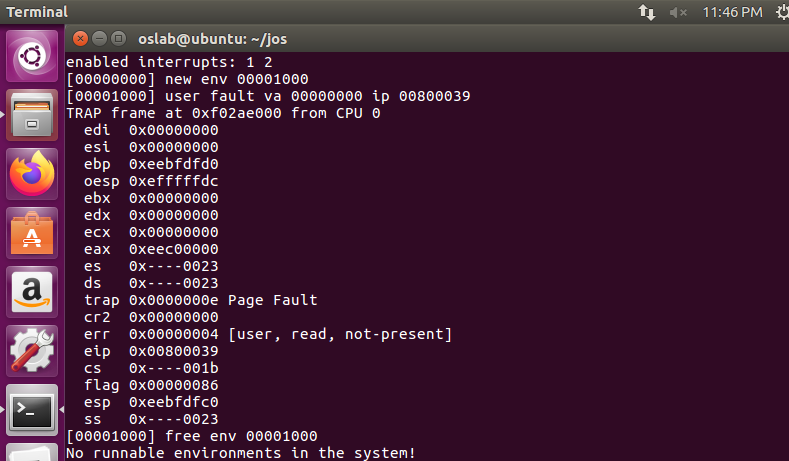

运行 `user/faultdie`

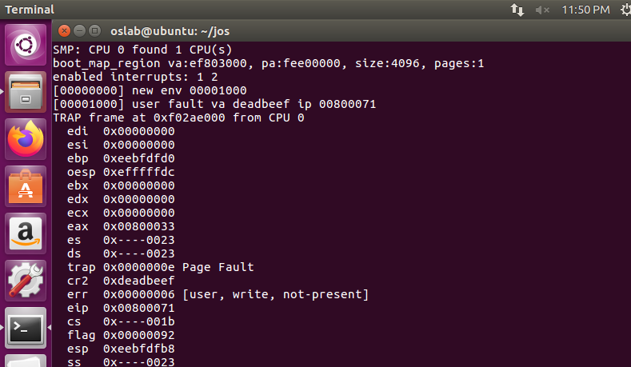

运行 `user/faultalloc`，你将会看到：

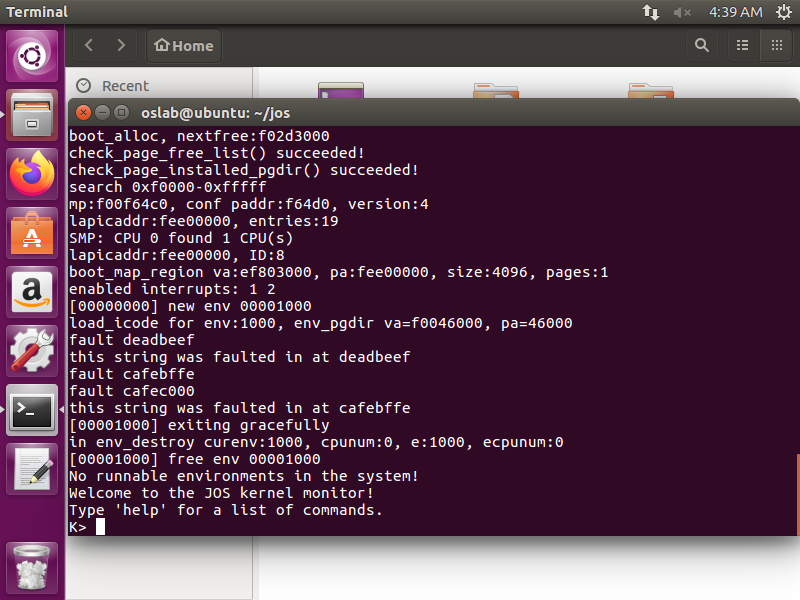

运行 `user/faultallocbad` 你将会看到：

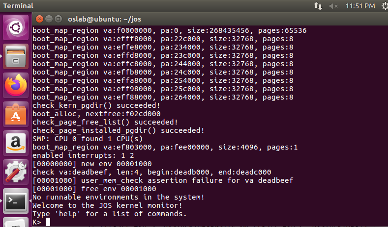

对比`faultalloc`和`faultallocbad`的代码，可以看到：

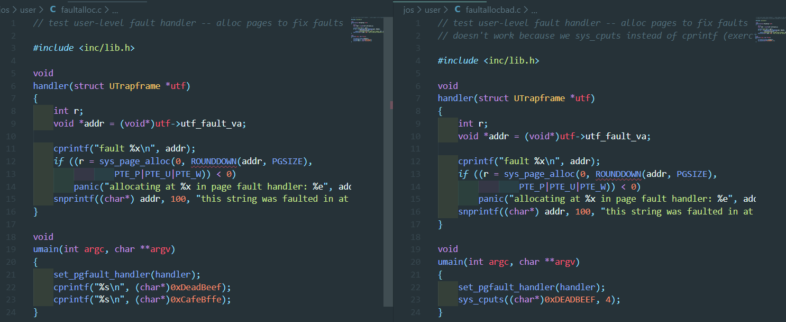

其实质上，一个是在内核下直接对sys_cputs进行相应的操作，会造成用户模式下的内存检测错误，而`faultalloc`则不会产生这种情况。

### exercise 12

#### 实现写时复制的Fork

我们为你在 `lib/fork.c` 提供了 `fork()` 方法的骨架。与 `dumbfork()` 相似，`fork()` 也应当创建一个新的进程，接下来，扫描整个父进程的地址空间，并在子进程中建立相应的页面映射。最关键的不同之处在于，`dumbfork()` 拷贝物理页，`fork()` 最初只拷贝 映射 。 `fork()` 只有在其中一个进程试图修改页面时才复制它。

`fork()` 最基本的控制流如下：

1. 父进程安装 `pgfault()` 作为 C 语言的缺页处理函数。这一步需要使用你在上面实现的 `set_pgfault_handler()`。
2. 父进程调用 `sys_exofork()` 创建一个子进程。
3. 对于其地址空间 `UTOP` 以下每一个可写的或者写时复制的页面，父进程调用一次 `duppage`，这个函数应当将这些页面在子进程的地址空间映射为写时复制的，同时还要在它自己的地址空间中重新映射为写时复制的。`duppage` 修改两个进程的 `PTE` 使得这个页面不再可写，并在 `avail` 段（译注：PTE的后12位中的某些位）包含 `PTE_COW` 以将写时复制的页面与真正的只读页面区分开来。

然而，异常堆栈并不能像这样被重新映射。与此不同，你需要重新在子进程中分配一个新的页面作为其异常堆栈。因为缺页处理函数执行这个复制工作，而缺页处理函数运行在异常堆栈上。如果它被标记成了写时复制，那谁来复制它呢？（译注：这是个反问）

fork()也需要处理那些存在，却不可写或者不是写时拷贝的页面。

1. 父进程设置子进程的缺页处理入口，就像设置自己的一样。
2. 现在子进程已经准备好运行了，所以父进程将其标记为可以运行。

每次进程写入写时复制的页面时，会造成一次缺页。这时缺页中断控制流：

1. 内核将缺页分发给 `_pgfault_upcall`，它会调用 `fork()` 的 `pgfault()`。
2. `pgfault()` 检查 ①这个缺页是不是写操作（在 error code 中检查 `FEC_WR`），②PTE 是否被标记为了 `PTE_COW`。如果不是，`panic`（译注：在这里 `panic` 说明你的代码在其他地方存在问题，也有可能是缺页处理函数本身的其他地方）。
3. `pgfault()` 在临时位置分配一个新的页面，并将造成缺页的页面内容拷贝给这个新的页面。接下来，将新的页面在恰当的地址映射为可读/写，替换原有的只读映射。

用户模式的 `lib/fork.c` 代码必须查询进程的页表来执行上面提到的一些操作（例如，得知一个页面的 PTE 是不是被标记为了 `PTE_COW` ）。内核将进程的页表映射在了 UVPT 就是为了这一目的。它使用了一种 [聪明的映射技巧](http://oslab.mobisys.cc/pdos.csail.mit.edu/6.828/2014/labs/lab4/uvpt.html) 使得用户代码查询 PTE 变得更简单。 `lib/entry.S` 设置了 `uvpt` 和 `uvpd` 所以你可以很容易地在 `lib/fork.c` 中找到页表的信息。

#### 要求

实现在 `lib/fork.c` 中的 `fork`，`duppage` 和 `pgfault`。 用 `forktree` 程序来测试你的代码(`make run-forktree`)。它应当产生下面的输出，其中夹杂着 **new env**, **free env** 和 **exiting gracefully** 这样的消息。下面的这些输出可能不是按照顺序的，进程ID也可能有所不同：

```shell
1000: I am ''
1001: I am '0'
2000: I am '00'
2001: I am '000'
1002: I am '1'
3000: I am '11'
3001: I am '10'
4000: I am '100'
1003: I am '01'
5000: I am '010'
4001: I am '011'
2002: I am '110'
1004: I am '001'
1005: I am '111'
1006: I am '101'
```

#### 解答：

对三个函数实现如下

```c
static void
pgfault(struct UTrapframe *utf)
{
	void *addr = (void *) utf->utf_fault_va;
	uint32_t err = utf->utf_err;
	int r;

	// Check that the faulting access was (1) a write, and (2) to a
	// copy-on-write page.  If not, panic.
	// Hint:
	//   Use the read-only page table mappings at uvpt
	//   (see <inc/memlayout.h>).

	// LAB 4: Your code here.
	// panic("pgfault not implemented");

	if (!((err & FEC_WR) && (uvpd[PDX(addr)] & PTE_P)
			&& (uvpt[PGNUM(addr)] & PTE_COW) && (uvpt[PGNUM(addr)] & PTE_P)))
		panic("page cow check failed");

	// Allocate a new page, map it at a temporary location (PFTEMP),
	// copy the data from the old page to the new page, then move the new
	// page to the old page's address.
	// Hint:
	//   You should make three system calls.
	addr = ROUNDDOWN(addr, PGSIZE);

	// LAB 4: Your code here.
	if ((r = sys_page_alloc(0, PFTEMP, PTE_P|PTE_U|PTE_W)))
		panic("sys_page_alloc: %e", r);

	memmove(PFTEMP, addr, PGSIZE);

	if ((r = sys_page_map(0, PFTEMP, 0, addr, PTE_P|PTE_U|PTE_W)))
		panic("sys_page_map: %e", r);

	if ((r = sys_page_unmap(0, PFTEMP)))
		panic("sys_page_unmap: %e", r);

}

//
// Map our virtual page pn (address pn*PGSIZE) into the target envid
// at the same virtual address.  If the page is writable or copy-on-write,
// the new mapping must be created copy-on-write, and then our mapping must be
// marked copy-on-write as well.  (Exercise: Why do we need to mark ours
// copy-on-write again if it was already copy-on-write at the beginning of
// this function?)
//
// Returns: 0 on success, < 0 on error.
// It is also OK to panic on error.
//
static int
duppage(envid_t envid, unsigned pn)
{
	int r;
	// LAB 4: Your code here.
	// panic("duppage not implemented");
	void *addr = (void *)(pn * PGSIZE);
	if (uvpt[pn] & (PTE_W|PTE_COW)) {
		if ((r = sys_page_map(0, addr, envid, addr, PTE_COW|PTE_U|PTE_P)) < 0)
			panic("sys_page_map COW:%e", r);

		if ((r = sys_page_map(0, addr, 0, addr, PTE_COW|PTE_U|PTE_P)) < 0)
			panic("sys_page_map COW:%e", r);
	} else {
		if ((r = sys_page_map(0, addr, envid, addr, PTE_U|PTE_P)) < 0)
			panic("sys_page_map UP:%e", r);
	}
	return 0;
}

//
// User-level fork with copy-on-write.
// Set up our page fault handler appropriately.
// Create a child.
// Copy our address space and page fault handler setup to the child.
// Then mark the child as runnable and return.
//
// Returns: child's envid to the parent, 0 to the child, < 0 on error.
// It is also OK to panic on error.
//
// Hint:
//   Use uvpd, uvpt, and duppage.
//   Remember to fix "thisenv" in the child process.
//   Neither user exception stack should ever be marked copy-on-write,
//   so you must allocate a new page for the child's user exception stack.
//
envid_t
fork(void)
{
	// LAB 4: Your code here.
	// panic("fork not implemented");
	set_pgfault_handler(pgfault);

	envid_t envid = sys_exofork();
	uint8_t *addr;
	if (envid < 0)
		panic("sys_exofork:%e", envid);
	if (envid == 0) {
		thisenv = &envs[ENVX(sys_getenvid())];
		return 0;
	}

	extern unsigned char end[];
	for (addr = (uint8_t *)UTEXT; addr < end; addr += PGSIZE) {
		if ((uvpd[PDX(addr)] & PTE_P) && (uvpt[PGNUM(addr)] & PTE_P)
				&& (uvpt[PGNUM(addr)] & PTE_U)) {
			duppage(envid, PGNUM(addr));
		}
	}

	duppage(envid, PGNUM(ROUNDDOWN(&addr, PGSIZE)));

	int r;
	if ((r = sys_page_alloc(envid, (void *)(UXSTACKTOP - PGSIZE), PTE_P|PTE_U|PTE_W)))
		panic("sys_page_alloc:%e", r);

	extern void _pgfault_upcall();
	sys_env_set_pgfault_upcall(envid, _pgfault_upcall);

	if ((r = sys_env_set_status(envid, ENV_RUNNABLE)))
		panic("sys_env_set_status:%e", r);

	return envid;
}
```

根据相应的注释和之前所给出的提示，在`lib/entry.S`中设置了`uvpt` 和 `uvpd` 所以你可以很容易地在 `lib/fork.c` 中找到页表的信息（即page table 和 page directory)，故根据此，可以去检查相应的权限是否正确。然后根据`allocate`，`map`和`unmap`等操作，具体对每一步进行相应的检测即可。

`duppage`函数只需要将相应的权限一直映射到相应的内存，并检测是否能映射成功即可。

根据前述要求，`fork`函数需要完成`pgfault`和`sys_exofork()`并且对于其相应地址空间调用一次`duppage`，并且需要检测当前的进程状态。

运行`make run-forktree`

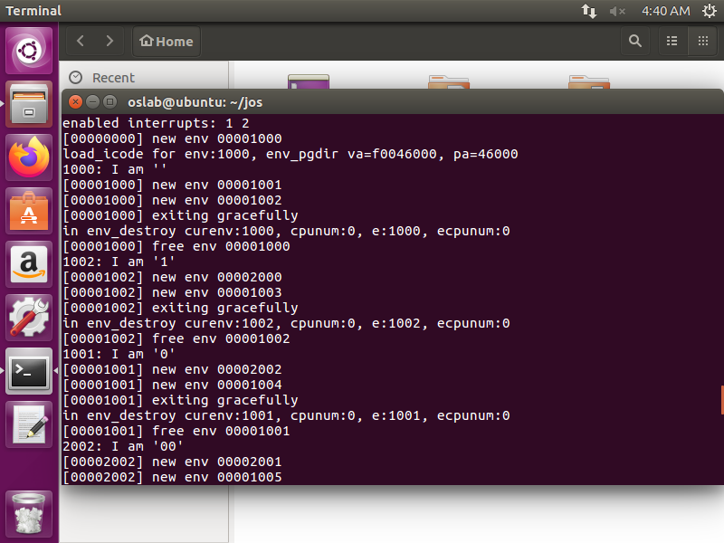

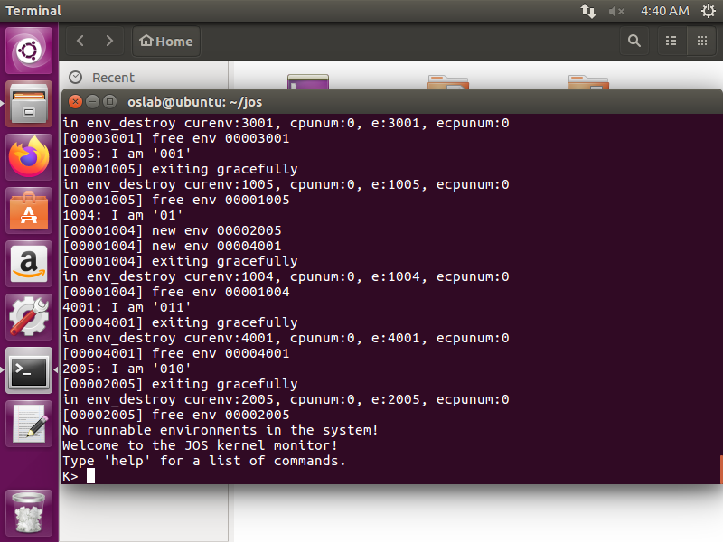

## PART C

### exercise 13

#### 时钟中断和抢占

运行测试程序 `user/spin` 。这个测试程序创建一个子进程，一旦子进程占据 CPU  ，它将永远循环下去。无论是父进程还是内核都无法再重新占据 CPU 。对于保护系统不受 Bug  或者用户模式的恶意进程影响来说，这显然不是一个理想的情况，因为任何一个用户进程，只要无限循环，不再让出  CPU，就会让整个系统宕机。为了允许内核能够抢占 (preemption)一个运行中的进程，强制从其上取得 CPU 的控制权，我们必须拓展我们的 JOS 内核以支持时钟硬件发出的外部硬件中断。

#### 中断原理

外部中断（或者说，设备中断）被称为 **IRQ**（interrupt request） ，有 16 个可能的 IRQ，编号是从 0 到 15。 将 IRQ 映射到 IDT 入口的方法不是固定的。`picirq.c` 中的 `pic_init` 方法将 0-15 号 IRQ 映射到了 IDT 入口的 `IRQ_OFFSET` 到 `IRQ_OFFSET + 15` 的位置。

```c
void
pic_init(void)
{
	didinit = 1;

	// mask all interrupts
	outb(IO_PIC1+1, 0xFF);
	outb(IO_PIC2+1, 0xFF);

	// Set up master (8259A-1)

	// ICW1:  0001g0hi
	//    g:  0 = edge triggering, 1 = level triggering
	//    h:  0 = cascaded PICs, 1 = master only
	//    i:  0 = no ICW4, 1 = ICW4 required
	outb(IO_PIC1, 0x11);

	// ICW2:  Vector offset
	outb(IO_PIC1+1, IRQ_OFFSET);

	// ICW3:  bit mask of IR lines connected to slave PICs (master PIC),
	//        3-bit No of IR line at which slave connects to master(slave PIC).
	outb(IO_PIC1+1, 1<<IRQ_SLAVE);

	// ICW4:  000nbmap
	//    n:  1 = special fully nested mode
	//    b:  1 = buffered mode
	//    m:  0 = slave PIC, 1 = master PIC
	//	  (ignored when b is 0, as the master/slave role
	//	  can be hardwired).
	//    a:  1 = Automatic EOI mode
	//    p:  0 = MCS-80/85 mode, 1 = intel x86 mode
	outb(IO_PIC1+1, 0x3);

	// Set up slave (8259A-2)
	outb(IO_PIC2, 0x11);			// ICW1
	outb(IO_PIC2+1, IRQ_OFFSET + 8);	// ICW2
	outb(IO_PIC2+1, IRQ_SLAVE);		// ICW3
	// NB Automatic EOI mode doesn't tend to work on the slave.
	// Linux source code says it's "to be investigated".
	outb(IO_PIC2+1, 0x01);			// ICW4

	// OCW3:  0ef01prs
	//   ef:  0x = NOP, 10 = clear specific mask, 11 = set specific mask
	//    p:  0 = no polling, 1 = polling mode
	//   rs:  0x = NOP, 10 = read IRR, 11 = read ISR
	outb(IO_PIC1, 0x68);             /* clear specific mask */
	outb(IO_PIC1, 0x0a);             /* read IRR by default */

	outb(IO_PIC2, 0x68);               /* OCW3 */
	outb(IO_PIC2, 0x0a);               /* OCW3 */

	if (irq_mask_8259A != 0xFFFF)
		irq_setmask_8259A(irq_mask_8259A);
}
```

在 `inc/trap.h`，`IRQ_OFFSET` 被定义为 32， 因此 IDT 入口的 32-47 就相应的对应 IRQ 的 0-15。例如，时钟中断是 IRQ 0，所以内核中的 `IDT[IRQ_OFFSET + 0]`（即，IDT[32] )包含时钟中断的中断处理函数的地址（译注：这是你在接下来的练习中应当实现的内容）。选择这个 `IRQ_OFFSET` 的原因，是因为设备中断不会与处理器中断有所重叠，否则显然会造成困扰。（事实上，在早些日子，个人计算机运行 MS-DOS 时，`IRQ_OFFSET` 取值就是 0，这当然为处理设备中断和处理器中断造成了大量困扰。）

在 JOS 中，我们和 xv6 Unix 相比做了关键的简化。在内核运行时，外部设备的中断总是被禁止（和 xv6 一样，在用户空间时启用。）外部中断被处在 `%eflags` 的 `FL_IF` 标志位控制（参考 `inc/mmu.h`）。当这一位被置位时，外部中断被打开。这个标志位可以有多种方式被修改，但为了简化，我们仅仅需要在保存和恢复 `%eflags` 的时候，即，进入或退出用户模式时，修改。

你需要确保 `FL_IF`  标志位在用户进程运行时总是被设置的，以使得每当中断到达的时候，它会被传入处理器并被你的中断处理代码处理。否则，我们说中断被屏蔽(mask)了，或 者说，被忽略了，直到中断被重新打开。我们已经在 bootloader 的一开始屏蔽了中断，到目前为止我们还从未重新打开它。

#### 要求

修改 `kern/trapenrty.S` 和 `kern/trap.c` 来初始化一个合适的 IDT 入口，并为 IRQ 0-15 提供处理函数。接着，修改 `kern/env.c` 中的`env_alloc()` 以确保用户进程总是在中断被打开的情况下运行。

当调用用户中断处理函数时，处理器从来不会将 error code 压栈，也不会检查IDT 入口的描述符特权等级 (Descriptor Privilege Level, DPL) 。此时你可能需要重新阅读一下 [80386 手册](http://oslab.mobisys.cc/pdos.csail.mit.edu/6.828/2014/readings/i386/toc.htm) 中 9.2 这一部分，或者 [IA-32 Intel Architecture Software Developer’s Manual](http://oslab.mobisys.cc/pdos.csail.mit.edu/6.828/2014/readings/ia32/IA32-3A.pdf), Volume 3 的 5.8 章节。

完成这个练习后，当你运行任何一个运行时间较长的测试程序时（比如 `make run-spin`），你应当看见内核打印 硬件中断的 trap frame。因为到目前为止，虽然处理器的硬件中断已经被打开了，但 JOS  还没有处理它，所以你应该注意到，它以为这个中断发生在正在运行的用户进程，并将其销毁。最终当没有进程可以销毁的时候，JOS 会陷入内核监视器。

#### 解答

修改`kern/trapentry.S`进行相应的初始化。

```assembly

TRAPHANDLER_NOEC(handler32, IRQ_OFFSET + IRQ_TIMER)
TRAPHANDLER_NOEC(handler33, IRQ_OFFSET + IRQ_KBD)
TRAPHANDLER_NOEC(handler36, IRQ_OFFSET + IRQ_SERIAL)
TRAPHANDLER_NOEC(handler39, IRQ_OFFSET + IRQ_SPURIOUS)
TRAPHANDLER_NOEC(handler46, IRQ_OFFSET + IRQ_IDE)
TRAPHANDLER_NOEC(handler51, IRQ_OFFSET + IRQ_ERROR)
```

根据相应的手册中的说明，可以知道，其具体的对应可以在`kern/trapentry.S`中设置为此。

修改`kern/trap.c`进行相应的对应处理：

```c
	void handler32();
	void handler33();
	void handler36();
	void handler39();
	void handler46();
	void handler51();

	SETGATE(idt[IRQ_OFFSET+IRQ_TIMER], 0, GD_KT, handler32, 0);
	SETGATE(idt[IRQ_OFFSET+IRQ_KBD], 0, GD_KT, handler33, 0);
	SETGATE(idt[IRQ_OFFSET+IRQ_SERIAL], 0, GD_KT, handler36, 0);
	SETGATE(idt[IRQ_OFFSET+IRQ_SPURIOUS], 0, GD_KT, handler39, 0);
	SETGATE(idt[IRQ_OFFSET+IRQ_IDE], 0, GD_KT, handler46, 0);
	SETGATE(idt[IRQ_OFFSET+IRQ_ERROR], 0, GD_KT, handler51, 0);
```

因此，这样已经将相应的IRQ与其中的处理对应起来，接下来需要修改`env_alloc()`函数，来确保用户进程总是在中断被打开的情况下运行。

```c
	e->env_tf.tf_eflags |= FL_IF;
```

即需要设置当前用户进程的eflags中的EL_IF始终被置位即可。根据80386手册中相应的9.2这一部分的[说明](http://oslab.mobisys.cc/pdos.csail.mit.edu/6.828/2014/readings/i386/s09_02.htm)，可以看到其具体调用用户处理函数时处理器的相应操作。

### exercise 14

#### 处理中断时钟

在测试程序 `user/spin` 中，子进程一旦运行，它就会不断地循环，内核则不再能重新取得控制权。我们需要为硬件编程，使其定期产生时钟中断，当收到中断时内核将会夺回控制权，从而我们可以切换到不同的用户进程。

```c
#include <inc/lib.h>

void
umain(int argc, char **argv)
{
	envid_t env;

	cprintf("I am the parent.  Forking the child...\n");
	if ((env = fork()) == 0) {
		cprintf("I am the child.  Spinning...\n");
		while (1)
			/* do nothing */;
	}

	cprintf("I am the parent.  Running the child...\n");
	sys_yield();
	sys_yield();
	sys_yield();
	sys_yield();
	sys_yield();
	sys_yield();
	sys_yield();
	sys_yield();

	cprintf("I am the parent.  Killing the child...\n");
	sys_env_destroy(env);
}
```


我们为你写好的 `lapic_init` 和 `pic_init` （位于 `init.c` 的 `i386_init`） 函数中设置了时钟和中断控制器来产生中断。你现在需要完成处理这些中断的代码。

#### 要求

修改内核的 `trap_dispatch()` 函数，使得其每当收到时钟中断的时候，它会调用 `sched_yield()` 寻找另一个进程并运行。

你现在应当能让 `user/spin` 测试程序正常工作了（译注：这里有一个文档中没有提到的细节。如果你发现时钟中断只发生一次就再也不会发生了，你应当再去看看 `kern/lapic.c`）：父进程会创建子进程，`sys_yield()` 会切换到子进程几次，但在时间片过后父进程会重新占据 CPU，并最终杀死子进程并正常退出。

#### 解答

实际上只需要查看相应的调用即可，因此，修改`trap_dispatch()`函数如下：

```c
	if (tf->tf_trapno == IRQ_OFFSET + IRQ_TIMER) {
		// cprintf("irq timer\n");
		lapic_eoi();
		sched_yield();
		return;
	}
```

现在进行`make run-spin`，已经可以直接通过：

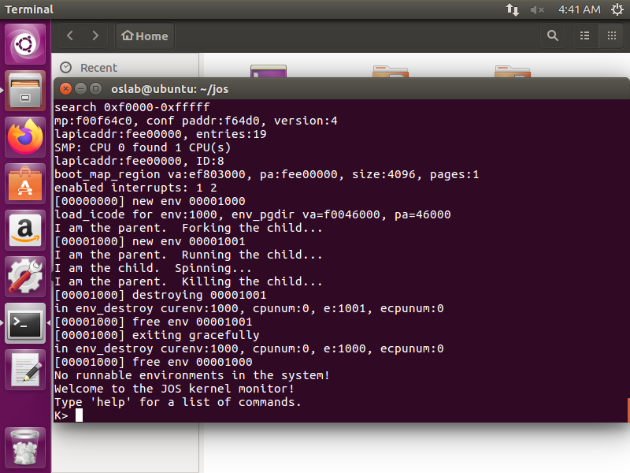

### exercise 15

#### 进程间通信（IPC）

技术上来讲在 JOS 中应该是 “环境间通信” 或者说 “IEC”，但是既然所有其他系统都叫它  IPC，我们也会用标准术语。）（译注：为了翻译方便，上文中的进程实际上均为 environment，我猜，也许你已经在 Lab 3 中习惯了把  环境 翻译成 进程了 >.< ）

我们一直着眼于操作系统的独立层面，即认为每一个进程都独立地享有机器的所有资源。但操作系统另一个重要服务是允许程序在它们想要通信的时候互相通信。允许程序与其他程序互动可以非常强大。Unix 的管道模型就是非常古典的例子。

有许多进程间通信的模型，即使直到今天对于哪种模型最好这一问题的仍有很多争议。我们不会与他们争执，而是实现一种简单的 IPC 策略并尝试它。

#### JOS的进程间通信

你现在需要实现一些额外的 JOS 系统调用，它们共同提供了一种简单的进程间通信方式。你将会实现两个系统调用 `sys_ipc_recv` 和 `sys_ipc_try_send`。接下来你会实现两个库封装 (library wrapper) 函数 `ipc_recv` 和 `ipc_send`。

使用 JOS 的进程间通信策略，用户进程可以互相发送的消息有两种；一个 32 位整数，一个可选的页面映射。允许用户进程在通信时传递页面映射与传递一个 32 位整数相比是一个非常有效的方式，同时也允许了用户进程能够很容易地安排共享内存区域。

#### 发送和接收信息

进程调用 `sys_ipc_recv`  来接受一个消息。系统调用将其移出运行队列，直到收到消息前都不再运行。当一个进程在等待接受消息状态时，任何一个进程都可以向它发送消息，而不是只有特 定的进程可以，也不仅限于它的父进程/子进程。换句话说，在 Part A 中你使用过的权限检查在 IPC 过程中就不再有用了，因为 IPC  系统调用经过仔细的设计以保证它是安全的：一个用户进程不会因为发送消息而导致另一个进程错误运行，除非另一个进程也同样存在 Bug。

进程调用 `sys_ipc_try_send` 来发送一个值。这个函数带有两个参数 接收者的进程ID 和 想要发送的值。如果目标进程正处于接收消息的状态（即，已经调用了 `sys_ipc_recv` 但还没有收到一个消息），这个函数将发送消息并返回0。否则函数返回 `-E_IPC_NOT_RECV` 来指示目标进程并不希望收到一个值。

用户空间的库函数 `ipc_recv` 会处理对 `sys_ipc_recv`的调用，并在当前进程的 `struct Env` 中查找有关收到的消息的一些信息。

与之相似，库函数 `ipc_send` 会处理对 `sys_ipc_try_send` 的重复调用直到信息发送成功。

#### 传递页面

进程调用 `sys_ipc_recv` 时如果带有一个有效的 `dstva` 参数（在 `UTOP` 之下），它即表明自己希望收到一个页映射。如果发送者发送了一个页面，这个页应当被映射在接收者地址空间的 `dstva` 位置。如果接收者在 `dstva` 位置已经映射了一个页面，之前的页面将被取消映射。

进程调用 `sys_ipc_try_send` 时如果带有一个有效的 `srcva` 参数（在 `UTOP` 之下），这意味着发送者希望发送一个目前映射在 `srcva` 的页面给接收者，权限是 `perm`。进程间通信成功后，发送者地址空间在 `srcva` 的原有页面保持不变，接收者在 `dstva` 获得一份同一个物理页的拷贝。这样做的结果是，这个物理页在发送者和接收者之间得以共享。

如果发送者或接收者之一没有提到应当传递页面，那么页面就不会传递。在任何一个进程间通信发生后，内核应当将接收者的 `struct Env` 中新的字段 `env_ipc_perm` 设置为接收到的页面权限，如果没有收到页面，应当设置为 0。

#### 要求

实现 `kern/syscall.c` 中的 `sys_ipc_recv` 和 `sys_ipc_try_send`。在实现它们前，你应当读读两边的注释，因为它们需要协同工作。当你在这些例程中调用 `envid2env` 时，你应当将 `checkperm` 设置为 0，这意味着进程可以与任何其他进程通信，内核除了确保目标进程 ID 有效之外，不会做其他任何检查。

接下来在 `lib/ipc.c` 中实现 `ipc_recv` 和 `ipc_send`。

用 `user/pingpong` 和 `user/primes` 来测试你的 IPC 机制。 `user/primes` 会为每一个素数生成一个新的进程，直到 JOS 已经没有新的进程页可以分配了。

`user/primes.c` 用来创建子进程和通信的代码读起来可能很有趣。（译注：可能因为 `user/primes` 的输出过多，有时无法从 QEMU 输出串口读取全部的输出，测试脚本可能判定程序运行错误。多运行几次试试看？）

#### 解答

关于在`kern/syscall.c`中的两个函数的实现，其具体代码为：

```c
static int
sys_ipc_try_send(envid_t envid, uint32_t value, void *srcva, unsigned perm)
{
	// LAB 4: Your code here.
	// panic("sys_ipc_try_send not implemented");
	struct Env *e;
	if (envid2env(envid, &e, 0)) return -E_BAD_ENV;

	if (!e->env_ipc_recving) return -E_IPC_NOT_RECV;

	if (srcva < (void *) UTOP) {
		if(PGOFF(srcva)) return -E_INVAL;

		pte_t *pte;
		struct PageInfo *p = page_lookup(curenv->env_pgdir, srcva, &pte);
		if (!p) return -E_INVAL;

		int valid_perm = (PTE_U|PTE_P);
		if ((perm & valid_perm) != valid_perm) {
			return -E_INVAL;
		}

		if ((perm & PTE_W) && !(*pte & PTE_W)) return -E_INVAL;

		if (e->env_ipc_dstva < (void *)UTOP) {
			int ret = page_insert(e->env_pgdir, p, e->env_ipc_dstva, perm);
			if (ret) return ret;
			e->env_ipc_perm = perm;
		}
	}

	e->env_ipc_recving = 0;
	e->env_ipc_from = curenv->env_id;
	e->env_ipc_value = value;
	e->env_status = ENV_RUNNABLE;
	e->env_tf.tf_regs.reg_eax = 0;
	return 0;
}

static int
sys_ipc_recv(void *dstva)
{
	// LAB 4: Your code here.
	// panic("sys_ipc_recv not implemented");
	if ((dstva < (void *)UTOP) && PGOFF(dstva))
		return -E_INVAL;

	curenv->env_ipc_recving = 1;
	curenv->env_status = ENV_NOT_RUNNABLE;
	curenv->env_ipc_dstva = dstva;
	sys_yield();
	return 0;
}
```

对于`sys_ipc_recv`函数，其实现过程相对较为简单，其实际上只需要判断当前的地址空间是否满足，然后设置当前的`env_ipc_recving`位为1即可，同时需要当前进程的状态即可，最后需要调用`sys_yield`函数。

对于`sys_ipc_try_send`函数，首先需要根据相应的提示，调用`envid2env`，然后查看是否有在receive的进程，并且根据注释进行相应的检测，主要是对于当前进程权限的检测。

然后需要在`lib/ipc.c`中实现两个相应函数，其结果为：

```c
int32_t
ipc_recv(envid_t *from_env_store, void *pg, int *perm_store)
{
	// LAB 4: Your code here.
	// panic("ipc_recv not implemented");
	if (pg == NULL) pg = (void *)UTOP;

	int r = sys_ipc_recv(pg);
	int from_env = 0, perm = 0;
	if (r == 0) {
		from_env = thisenv->env_ipc_from;
		perm = thisenv->env_ipc_perm;
		r = thisenv->env_ipc_value;
	} else {
		from_env = 0;
		perm = 0;
	}

	if (from_env_store) *from_env_store = from_env;
	if (perm_store) *perm_store = perm;

	return r;
}

void
ipc_send(envid_t to_env, uint32_t val, void *pg, int perm)
{
	// LAB 4: Your code here.
	// panic("ipc_send not implemented");
	if (pg == NULL) pg = (void *)UTOP;

	int ret;
	while ((ret = sys_ipc_try_send(to_env, val, pg, perm))) {
		if (ret != -E_IPC_NOT_RECV) panic("ipc_send error %e", ret);
		sys_yield();
	}
}
```

这两个函数的实现方式非常简单，对于`ipc_recv`而言，只需要调用系统中的ipc的通信接收过程，然后根据最终接收到的通信结果和相应函数的返回来进行处理即可。

而对于`ipc_send`而言，也同样很简单，只需要判断发送是否成功，如果不成功，panic即可，否则，调用sys_yield()函数。

最终，完成本次实验：


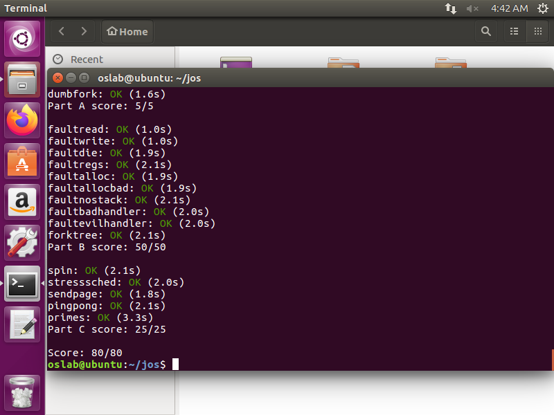

